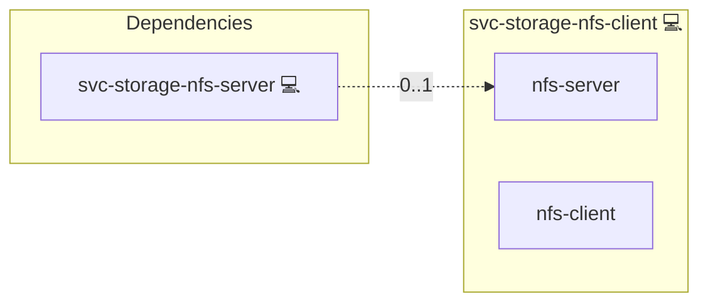

# NFS Client

## Description

[NFS](https://en.wikipedia.org/wiki/Network_File_System) (Network File
System) lets a host mount a directory exported by a remote server as if
it were a local filesystem. The client packages provide the kernel
helpers and userspace tools to perform that mount.

## Overview

This role installs the distro-appropriate NFS client packages on every
host in the Ansible group `svc-swarm-node` and probe-mounts the
configured `storage.nfs.server` and the export base from the
svc-storage-nfs-server services.yml SPOT to confirm
reachability and writability at deploy time. The actual docker volume
mounts happen later, driven by the Docker engine at container start.

## Cosmos

The diagram places NFS Client in the Infinito.Nexus cosmos: the components it deploys (capabilities), the central services it consumes (dependencies), and its outward reach (federation and bridged external networks).



Solid `1:1` edges are fixed relationships; dashed `0..1` edges are conditional (enabled only in matching deployments). Node markers show the role's deploy modes (💻 host, 🐳 compose, 🐝 swarm); ❌ marks a service that is explicitly turned off, and ⚙️ an Ansible role dependency declared in `meta/main.yml`.

## Features

- **Distro-aware packages:** Installs `nfs-common` on Debian/Ubuntu,
  `nfs-utils` on Arch / RHEL / Fedora / Alpine.
- **Ephemeral probe mount:** Mounts the export, writes a marker, then
  unmounts; failures surface immediately at deploy time, never at first
  container boot.
- **Strict assertion:** Missing `storage.nfs.server` or
  fails the deploy with a precise error.

## Quick Setup

### Development

Clone, set up the workstation, and deploy NFS Client onto the local stack:

```bash
git clone https://github.com/infinito-nexus/core.git
cd core
make onboard
make compose-deploy mode=reinstall apps=svc-storage-nfs-client full_cycle=false
```

### Production

Install NFS Client directly onto the target machine — clone the repository, install the OS prerequisites and the repository toolchain, then deploy against localhost over a local connection (no SSH, no container):

```bash
git clone https://github.com/infinito-nexus/core.git
cd core
bash scripts/install/package.sh
make install
source scripts/meta/env/load.sh

APP=svc-storage-nfs-client
TLS_MODE=self_signed
SSH_PUBLIC_KEY="<your-ssh-public-key>"
INVENTORY=inventories/production
infinito administration inventory provision "$INVENTORY" \
  --inventory-file "$INVENTORY/devices.yml" \
  --host localhost \
  --include "$APP" \
  --vars "{\"TLS_MODE\": \"$TLS_MODE\", \"users\": {\"administrator\": {\"authorized_keys\": [\"$SSH_PUBLIC_KEY\"]}}}"
infinito administration deploy dedicated "$INVENTORY/devices.yml" \
  --password-file "$INVENTORY/.password" \
  --diff -vv
```

## Credits

Implemented by **[Kevin Veen-Birkenbach](https://www.veen.world)**.
Part of the [Infinito.Nexus Project](https://s.infinito.nexus/code) and maintained by [Kevin Veen-Birkenbach](https://www.veen.world).
Licensed under the [Infinito.Nexus Community License (Non-Commercial)](https://s.infinito.nexus/license).
