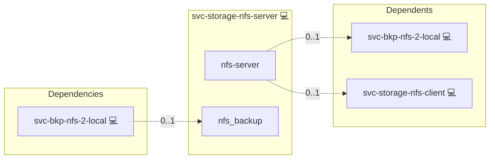

# NFS Server

## Description

[NFS](https://en.wikipedia.org/wiki/Network_File_System) (Network File
System) is a kernel-level protocol for sharing files over a network.
The server exports a directory tree under defined access rules; clients
mount it as if it were a local filesystem.

## Overview

This role installs the distro-appropriate NFS kernel server, exports
the export base from its own services.yml SPOT (`/srv/nfs`), and restricts access to
inventory members of the `svc-swarm-node` group. The export options
default to `rw,sync,no_subtree_check,root_squash,no_all_squash`. NFS
server HA, Kerberos integration, and client-side mounting are out of
scope; client mounts are handled by `svc-storage-nfs-client`.

## Cosmos

The diagram places NFS Server in the Infinito.Nexus cosmos: the components it deploys (capabilities), the central services it consumes (dependencies), and its outward reach (federation and bridged external networks).



Solid `1:1` edges are fixed relationships; dashed `0..1` edges are conditional (enabled only in matching deployments). Node markers show the role's deploy modes (💻 host, 🐳 compose, 🐝 swarm); ❌ marks a service that is explicitly turned off, and ⚙️ an Ansible role dependency declared in `meta/main.yml`.

## Features

- **Distro-aware install:** Installs `nfs-kernel-server` on Debian /
  Ubuntu, `nfs-utils` on Arch / RHEL / Fedora / Alpine.
- **Inventory-driven ACL:** Allowed-IP list derives from the
  `svc-swarm-node` group; unrelated hosts cannot mount.
- **Reload-on-change:** Re-running the role overwrites `/etc/exports`
  with the current allowed-IP set; the handler reloads via
  `exportfs -ra` only when the file changed.

## Quick Setup

### Development

Clone, set up the workstation, and deploy NFS Server onto the local stack:

```bash
git clone https://github.com/infinito-nexus/core.git
cd core
make onboard
make compose-deploy mode=reinstall apps=svc-storage-nfs-server full_cycle=false
```

### Production

Install NFS Server directly onto the target machine — clone the repository, install the OS prerequisites and the repository toolchain, then deploy against localhost over a local connection (no SSH, no container):

```bash
git clone https://github.com/infinito-nexus/core.git
cd core
bash scripts/install/package.sh
make install
source scripts/meta/env/load.sh

APP=svc-storage-nfs-server
TLS_MODE=self_signed
SSH_PUBLIC_KEY="<your-ssh-public-key>"
INVENTORY=inventories/production
infinito administration inventory provision "$INVENTORY" \
  --inventory-file "$INVENTORY/devices.yml" \
  --host localhost \
  --include "$APP" \
  --vars "{\"TLS_MODE\": \"$TLS_MODE\", \"users\": {\"administrator\": {\"authorized_keys\": [\"$SSH_PUBLIC_KEY\"]}}}"
infinito administration deploy dedicated "$INVENTORY/devices.yml" \
  --password-file "$INVENTORY/.password" \
  --diff -vv
```

## Credits

Implemented by **[Kevin Veen-Birkenbach](https://www.veen.world)**.
Part of the [Infinito.Nexus Project](https://s.infinito.nexus/code) and maintained by [Kevin Veen-Birkenbach](https://www.veen.world).
Licensed under the [Infinito.Nexus Community License (Non-Commercial)](https://s.infinito.nexus/license).
