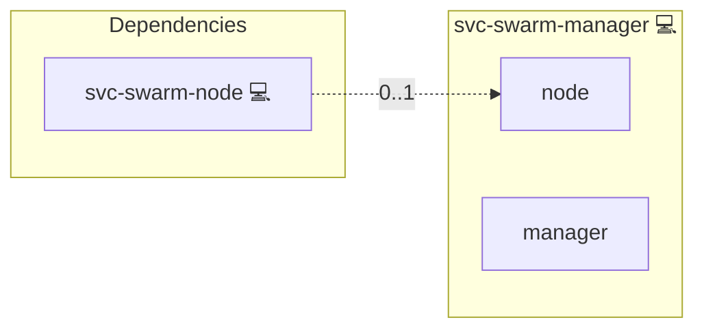

# Docker Swarm Manager

## Description

[Docker Swarm](https://docs.docker.com/engine/swarm/) groups Docker
hosts into a single virtual host. A swarm has exactly one manager node
in v1; managers run the Raft store and accept service-API calls.

## Overview

This role is a group-name tag. It exists so the project's inventory
validator accepts `svc-swarm-manager` as a legitimate
application_id. The actual swarm-init logic lives in `svc-swarm-node`
and dispatches on `'svc-swarm-manager' in group_names`.

## Cosmos

The diagram places Docker Swarm Manager in the Infinito.Nexus cosmos: the components it deploys (capabilities), the central services it consumes (dependencies), and its outward reach (federation and bridged external networks).



Solid `1:1` edges are fixed relationships; dashed `0..1` edges are conditional (enabled only in matching deployments). Node markers show the role's deploy modes (💻 host, 🐳 compose, 🐝 swarm); ❌ marks a service that is explicitly turned off, and ⚙️ an Ansible role dependency declared in `meta/main.yml`.

## Features

- **Marker role:** Carries no tasks; selects which `svc-swarm-node`
  member runs the manager-init flow.

## Quick Setup

### Development

Clone, set up the workstation, and deploy Docker Swarm Manager onto the local stack:

```bash
git clone https://github.com/infinito-nexus/core.git
cd core
make onboard
make compose-deploy mode=reinstall apps=svc-swarm-manager full_cycle=false
```

### Production

Install Docker Swarm Manager directly onto the target machine — clone the repository, install the OS prerequisites and the repository toolchain, then deploy against localhost over a local connection (no SSH, no container):

```bash
git clone https://github.com/infinito-nexus/core.git
cd core
bash scripts/install/package.sh
make install
source scripts/meta/env/load.sh

APP=svc-swarm-manager
TLS_MODE=self_signed
SSH_PUBLIC_KEY="<your-ssh-public-key>"
INVENTORY=inventories/production
infinito administration inventory provision "$INVENTORY" \
  --inventory-file "$INVENTORY/devices.yml" \
  --host localhost \
  --include "$APP" \
  --vars "{\"TLS_MODE\": \"$TLS_MODE\", \"users\": {\"administrator\": {\"authorized_keys\": [\"$SSH_PUBLIC_KEY\"]}}}"
infinito administration deploy dedicated "$INVENTORY/devices.yml" \
  --password-file "$INVENTORY/.password" \
  --diff -vv
```

## Credits

Implemented by **[Kevin Veen-Birkenbach](https://www.veen.world)**.
Part of the [Infinito.Nexus Project](https://s.infinito.nexus/code) and maintained by [Kevin Veen-Birkenbach](https://www.veen.world).
Licensed under the [Infinito.Nexus Community License (Non-Commercial)](https://s.infinito.nexus/license).
