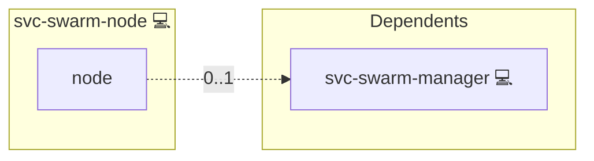

# Docker Swarm

## Description

[Docker Swarm](https://docs.docker.com/engine/swarm/) is Docker's
built-in clustering and container-orchestration mode. It groups multiple
Docker hosts into a single virtual host that can schedule services,
replicate tasks, and route traffic via an internal mesh.

## Overview

This role bootstraps and manages a Docker Swarm cluster across the
hosts in the Ansible group `svc-swarm-node`. The manager is the single
host in `svc-swarm-manager`; every other group member joins as a
worker. Membership is expressed via group membership only, never via
duplicated lists in `group_vars`. Inventory node labels are pushed to
the cluster after the join phase.

## Cosmos

The diagram places Docker Swarm in the Infinito.Nexus cosmos: the components it deploys (capabilities), the central services it consumes (dependencies), and its outward reach (federation and bridged external networks).



Solid `1:1` edges are fixed relationships; dashed `0..1` edges are conditional (enabled only in matching deployments). Node markers show the role's deploy modes (💻 host, 🐳 compose, 🐝 swarm); ❌ marks a service that is explicitly turned off, and ⚙️ an Ansible role dependency declared in `meta/main.yml`.

## Features

- **Single-manager bootstrap:** Initialises the cluster on the manager
  with the configured advertise address; idempotent on re-runs.
- **Auto-derived workers:** `svc-swarm-node - svc-swarm-manager`
  yields the worker set; no separate `worker_nodes` list to drift.
- **Token publishing:** Manager-fetched worker/manager join tokens are
  published as facts to every cluster member.
- **Node labels:** Per-host labels declared via `swarm_node_labels` in
  inventory are applied to the joining node.
- **Mode-selection trigger:** Membership in `svc-swarm-node` resolves
  `DEPLOYMENT_MODE = swarm` for every web-app role on that host.

## Quick Setup

### Development

Clone, set up the workstation, and deploy Docker Swarm onto the local stack:

```bash
git clone https://github.com/infinito-nexus/core.git
cd core
make onboard
make compose-deploy mode=reinstall apps=svc-swarm-node full_cycle=false
```

### Production

Install Docker Swarm directly onto the target machine — clone the repository, install the OS prerequisites and the repository toolchain, then deploy against localhost over a local connection (no SSH, no container):

```bash
git clone https://github.com/infinito-nexus/core.git
cd core
bash scripts/install/package.sh
make install
source scripts/meta/env/load.sh

APP=svc-swarm-node
TLS_MODE=self_signed
SSH_PUBLIC_KEY="<your-ssh-public-key>"
INVENTORY=inventories/production
infinito administration inventory provision "$INVENTORY" \
  --inventory-file "$INVENTORY/devices.yml" \
  --host localhost \
  --include "$APP" \
  --vars "{\"TLS_MODE\": \"$TLS_MODE\", \"users\": {\"administrator\": {\"authorized_keys\": [\"$SSH_PUBLIC_KEY\"]}}}"
infinito administration deploy dedicated "$INVENTORY/devices.yml" \
  --password-file "$INVENTORY/.password" \
  --diff -vv
```

## Credits

Implemented by **[Kevin Veen-Birkenbach](https://www.veen.world)**.
Part of the [Infinito.Nexus Project](https://s.infinito.nexus/code) and maintained by [Kevin Veen-Birkenbach](https://www.veen.world).
Licensed under the [Infinito.Nexus Community License (Non-Commercial)](https://s.infinito.nexus/license).
