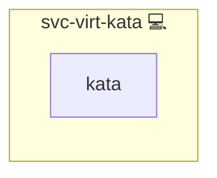

# Kata & gVisor

## Description

[Kata Containers](https://katacontainers.io/) is an OCI container runtime that starts each container inside a lightweight virtual machine with its own kernel instead of sharing the host kernel. [gVisor](https://gvisor.dev/) is a second isolating runtime, shipped as the single `runsc` binary, that intercepts container syscalls in a userspace kernel and runs without hardware virtualization.

## Overview

This role provisions the isolating runtime layer of a container host. It installs the pinned gVisor binary, probes the host for hardware virtualization and for an already-installed Kata shim, publishes the runtime that this host can carry as `SANDBOX_RUNTIME`, and registers both runtimes with the container daemon. In swarm mode it additionally labels the node with the runtime that was selected for it.

## Cosmos

The diagram places Kata & gVisor in the Infinito.Nexus cosmos: the components it deploys (capabilities), the central services it consumes (dependencies), and its outward reach (federation and bridged external networks).



Solid `1:1` edges are fixed relationships; dashed `0..1` edges are conditional (enabled only in matching deployments). Node markers show the role's deploy modes (💻 host, 🐳 compose, 🐝 swarm); ❌ marks a service that is explicitly turned off, and ⚙️ an Ansible role dependency declared in `meta/main.yml`.

## Features

- **gVisor runtime:** The pinned `runsc` release is fetched to `/usr/local/bin/runsc` and verified against its published SHA-512 checksum. The Kata shim is taken from the host as it is; the role does not install it.
- **Runtime probing:** Every host is checked for `/dev/kvm`, for the Kata shim binary and for docker-in-docker, and the resulting choice between `kata` and `runsc` is published as `SANDBOX_RUNTIME` and logged at deploy time.
- **Daemon registration:** `kata` and `runsc` are added as named runtimes to the container daemon configuration and picked up by a daemon restart, on a bare host and inside docker-in-docker alike.
- **Node labelling:** In swarm mode the node is labelled `kata-capable` with the runtime that was selected for it.
- **Runtime pinning:** Hermes Agent and OpenClaw include the same selection tasks and pin the selected runtime on their compose services.

## Quick Setup

### Development

Clone, set up the workstation, and deploy Kata & gVisor onto the local stack:

```bash
git clone https://github.com/infinito-nexus/core.git
cd core
make onboard
make compose-deploy mode=reinstall apps=svc-virt-kata full_cycle=false
```

### Production

Install Kata & gVisor directly onto the target machine: clone the repository, install the OS prerequisites and the repository toolchain, then deploy against localhost over a local connection (no SSH, no container):

```bash
git clone https://github.com/infinito-nexus/core.git
cd core
bash scripts/install/package.sh
make install
source scripts/meta/env/load.sh

APP=svc-virt-kata
TLS_MODE=self_signed
SSH_PUBLIC_KEY="<your-ssh-public-key>"
INVENTORY=inventories/production
infinito administration inventory provision "$INVENTORY" \
  --inventory-file "$INVENTORY/devices.yml" \
  --host localhost \
  --include "$APP" \
  --vars "{\"TLS_MODE\": \"$TLS_MODE\", \"users\": {\"administrator\": {\"authorized_keys\": [\"$SSH_PUBLIC_KEY\"]}}}"
infinito administration deploy dedicated "$INVENTORY/devices.yml" \
  --password-file "$INVENTORY/.password" \
  --diff -vv
```

## Credits

Implemented by **[Kevin Veen-Birkenbach](https://www.veen.world)**.
Part of the [Infinito.Nexus Project](https://s.infinito.nexus/code) and maintained by [Kevin Veen-Birkenbach](https://www.veen.world).
Licensed under the [Infinito.Nexus Community License (Non-Commercial)](https://s.infinito.nexus/license).
