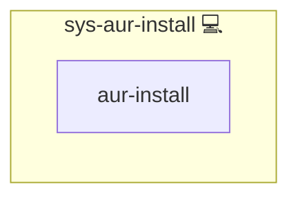

# sys-aur-install

## Description

Installs one or more AUR packages using `kewlfft.aur.aur` and the `yay` helper.

## Overview

This role wrapper role to install AUR packages via kewlfft.aur.aur using yay.

## Cosmos

The diagram places sys-aur-install in the Infinito.Nexus cosmos: the components it deploys (capabilities), the central services it consumes (dependencies), and its outward reach (federation and bridged external networks).



Solid `1:1` edges are fixed relationships; dashed `0..1` edges are conditional (enabled only in matching deployments). Node markers show the role's deploy modes (💻 host, 🐳 compose, 🐝 swarm); ❌ marks a service that is explicitly turned off, and ⚙️ an Ansible role dependency declared in `meta/main.yml`.

## Features

- **Automated provisioning:** Configured by Ansible without manual steps.

## Variables

- `yay_install_packages` (required for direct role usage): list of AUR package names
- `yay_install_upgrade` (optional): set `true` to upgrade all packages (mutually exclusive with `yay_install_packages`)
- `yay_install_use` (optional): helper binary, default `yay`
- `yay_install_become_user` (optional): user to execute AUR install, default `aur_builder`
- `SYS_AUR_PACKAGES` (inventory default): list used by constructor auto-install flow

## Example

```yaml
- name: Install MSI packages
  include_role:
    name: sys-aur-install
  vars:
    yay_install_packages:
      - msi-perkeyrgb
```

## Credits

Implemented by **[Kevin Veen-Birkenbach](https://www.veen.world)**.
Part of the [Infinito.Nexus Project](https://s.infinito.nexus/code) and maintained by [Kevin Veen-Birkenbach](https://www.veen.world).
Licensed under the [Infinito.Nexus Community License (Non-Commercial)](https://s.infinito.nexus/license).
