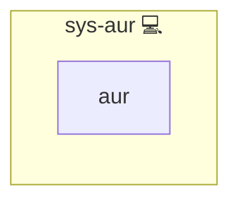

# System AUR Helper

## Description

This role ensures that the AUR helper [yay](https://github.com/Jguer/yay) is installed on the system. It installs yay via [pacman](https://wiki.archlinux.org/title/Pacman) and creates a dedicated `aur_builder` user to facilitate building AUR packages.

## Overview

The role performs the following tasks:

- Installs the AUR helper [yay](https://github.com/Jguer/yay) using pacman.
- Creates an `aur_builder` user with a home directory and adds the user to the wheel group.
- Grants the `aur_builder` user passwordless [sudo](https://en.wikipedia.org/wiki/Sudo) rights for running pacman.

## Cosmos

The diagram places System AUR Helper in the Infinito.Nexus cosmos: the components it deploys (capabilities), the central services it consumes (dependencies), and its outward reach (federation and bridged external networks).

Solid `1:1` edges are fixed relationships; dashed `0..1` edges are conditional (enabled only in matching deployments). Node markers show the role's deploy modes (💻 host, 🐳 compose, 🐝 swarm); ❌ marks a service that is explicitly turned off, and ⚙️ an Ansible role dependency declared in `meta/main.yml`.

## Purpose

The primary purpose of this role is to streamline AUR package management on Arch Linux systems by ensuring that the required AUR helper is installed and properly configured.

## Features

- **Yay Installation:** Installs the AUR helper [yay](https://github.com/Jguer/yay) on Arch Linux.
- **User Creation:** Creates a dedicated `aur_builder` user.
- **Sudo Configuration:** Grants passwordless sudo rights to `aur_builder` for pacman.

## Further Resources

- [ansible-aur](https://github.com/kewlfft/ansible-aur)

## Credits

Implemented by **[Kevin Veen-Birkenbach](https://www.veen.world)**.
Part of the [Infinito.Nexus Project](https://s.infinito.nexus/code) and maintained by [Kevin Veen-Birkenbach](https://www.veen.world).
Licensed under the [Infinito.Nexus Community License (Non-Commercial)](https://s.infinito.nexus/license).
