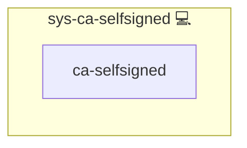

# sys-ca-selfsigned

## Description

Creates (once) a local Root CA (self-signed) for the Infinito.Nexus environment.

This role provisions:

- Root CA private key: `{{ CA_ROOT.key_host }}`
- Root CA certificate: `{{ CA_ROOT.cert_host }}`

The generated Root CA certificate can be injected into containers (e.g. via `sys-svc-compose-ca`) so that containers trust your internal TLS endpoints.

## Overview

This role provisions a local Root CA (self-signed, CA:TRUE) for trusting internal TLS endpoints. Produces /etc/infinito.nexus/ca/root-ca.crt for sys-svc-compose-ca injection.

## Cosmos

The diagram places sys-ca-selfsigned in the Infinito.Nexus cosmos: the components it deploys (capabilities), the central services it consumes (dependencies), and its outward reach (federation and bridged external networks).

Solid `1:1` edges are fixed relationships; dashed `0..1` edges are conditional (enabled only in matching deployments). Node markers show the role's deploy modes (💻 host, 🐳 compose, 🐝 swarm); ❌ marks a service that is explicitly turned off, and ⚙️ an Ansible role dependency declared in `meta/main.yml`.

## Features

- **Automated provisioning:** Configured by Ansible without manual steps.

## Outputs

- `CA_ROOT.cert_host` (default: `/etc/infinito.nexus/ca/root-ca.crt`)
- `CA_ROOT.key_host`  (default: `/etc/infinito.nexus/ca/root-ca.key`)

## Inputs

- `CA_ROOT` (mapping)
  - `base_dir` (string): base directory for CA files
  - `cert_host` (string): host path to Root CA certificate
  - `key_host` (string): host path to Root CA private key
  - `openssl_conf_host` (string): host path for generated openssl.cnf
  - `days` (int): certificate validity
  - `key_bits` (int): RSA key size
  - `subject` (mapping): DN fields (C/O/OU/CN)
  - `force_regen` (bool): if true, remove and regenerate key/cert

## Notes

- The Root CA private key is generated **unencrypted** (automation-friendly). Protect file permissions.
- This role does **not** sign leaf certificates. It only provisions the Root CA.

## Credits

Implemented by **[Kevin Veen-Birkenbach](https://www.veen.world)**.
Part of the [Infinito.Nexus Project](https://s.infinito.nexus/code) and maintained by [Kevin Veen-Birkenbach](https://www.veen.world).
Licensed under the [Infinito.Nexus Community License (Non-Commercial)](https://s.infinito.nexus/license).
