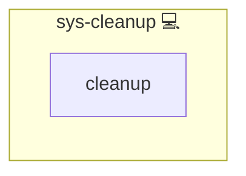

# sys-cleanup

## Description

Role to perform **cross-distribution system cleanup** for Infinito.Nexus environments.  
It removes package manager caches, language tool caches, temporary files, and other
build artefacts that accumulate on CI runners, containers, and build hosts.

The role is designed to be **distribution-agnostic** and works on:

- Arch Linux
- Debian / Ubuntu
- Fedora
- CentOS

## Overview

- Cleans package manager caches (`apt`, `pacman`, `dnf`, `yum`)
- Removes language and build tool caches (pip, npm, yarn, cargo, go, maven, gradle)
- Cleans temporary directories (`/tmp`, `/var/tmp`)
- Designed for CI, container, and build environments
- Prevents disk pressure and runaway image sizes

## Cosmos

The diagram places sys-cleanup in the Infinito.Nexus cosmos: the components it deploys (capabilities), the central services it consumes (dependencies), and its outward reach (federation and bridged external networks).

Solid `1:1` edges are fixed relationships; dashed `0..1` edges are conditional (enabled only in matching deployments). Node markers show the role's deploy modes (💻 host, 🐳 compose, 🐝 swarm); ❌ marks a service that is explicitly turned off, and ⚙️ an Ansible role dependency declared in `meta/main.yml`.

## Features

- **Cross-Distro Support:** Automatically detects the available package manager.
- **Safe Defaults:** Best-effort cleanup without breaking running services.
- **CI Optimized:** Prevents GitHub Actions images from growing uncontrollably.
- **Language Cache Cleanup:** Removes common build artefacts and tool caches.
- **Temp Cleanup:** Clears temporary directories after builds.

## Typical Use Cases

- GitHub Actions runners
- Local CI test containers
- Build hosts
- Ephemeral development environments
- Image build pipelines

## Further Resources

- [apt-get](https://manpages.debian.org/apt/apt-get.8.en.html)
- [pacman](https://man.archlinux.org/man/pacman.8)
- [dnf](https://dnf.readthedocs.io/en/latest/)
- [yum](https://man7.org/linux/man-pages/man8/yum.8.html)
- [Filesystem Hierarchy Standard](https://refspecs.linuxfoundation.org/FHS_3.0/fhs/index.html)

## Credits

Implemented by **[Kevin Veen-Birkenbach](https://www.veen.world)**.
Part of the [Infinito.Nexus Project](https://s.infinito.nexus/code) and maintained by [Kevin Veen-Birkenbach](https://www.veen.world).
Licensed under the [Infinito.Nexus Community License (Non-Commercial)](https://s.infinito.nexus/license).
