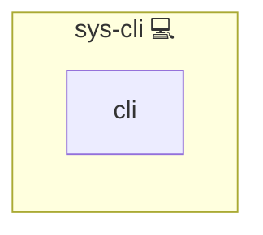

# Infinito.Nexus CLI

This Ansible role installs and makes the Infinito.Nexus CLI available on your system.

## Description

After deploying this role, you will have access to the `infinito` command-line interface (CLI), which is the central tool for managing and operating all aspects of your Infinito.Nexus environment.

## Overview

This role this role installs and provides the Infinito.Nexus CLI, enabling you to manage your entire Infinito.Nexus environment from the command line. After deployment, the `infinito` command is available.

## Cosmos

The diagram places Infinito.Nexus CLI in the Infinito.Nexus cosmos: the components it deploys (capabilities), the central services it consumes (dependencies), and its outward reach (federation and bridged external networks).



Solid `1:1` edges are fixed relationships; dashed `0..1` edges are conditional (enabled only in matching deployments). Node markers show the role's deploy modes (💻 host, 🐳 compose, 🐝 swarm); ❌ marks a service that is explicitly turned off, and ⚙️ an Ansible role dependency declared in `meta/main.yml`.

## Usage

Once this role has been applied, you can run all CLI commands using:

```

infinito --help

```

to get a list of available commands and options.

## Features

- Installs the Infinito.Nexus CLI automatically
- Ensures the CLI is available system-wide
- All commands accessible via `infinito --help`

## Further Resources

- [Infinito.Nexus Documentation](https://s.infinito.nexus/code/)

## Credits

Implemented by **[Kevin Veen-Birkenbach](https://www.veen.world)**.
Part of the [Infinito.Nexus Project](https://s.infinito.nexus/code) and maintained by [Kevin Veen-Birkenbach](https://www.veen.world).
Licensed under the [Infinito.Nexus Community License (Non-Commercial)](https://s.infinito.nexus/license).
