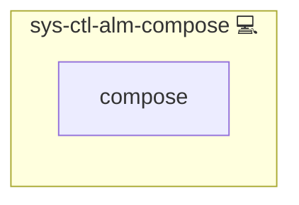

# Unified Service Failure Notifier

## Description

This role installs a systemd service that sends notifications via both [sys-ctl-alm-telegram](../sys-ctl-alm-telegram/README.md) and [sys-ctl-alm-email](../sys-ctl-alm-email/README.md) when any service fails.

## Overview

Optimized for prompt and comprehensive failure alerts, this role configures a unified notification service. It leverages the capabilities of both Telegram and Email notifications to ensure that administrators are quickly informed about service issues, enabling rapid troubleshooting.

## Cosmos

The diagram places Unified Service Failure Notifier in the Infinito.Nexus cosmos: the components it deploys (capabilities), the central services it consumes (dependencies), and its outward reach (federation and bridged external networks).

Solid `1:1` edges are fixed relationships; dashed `0..1` edges are conditional (enabled only in matching deployments). Node markers show the role's deploy modes (💻 host, 🐳 compose, 🐝 swarm); ❌ marks a service that is explicitly turned off, and ⚙️ an Ansible role dependency declared in `meta/main.yml`.

## Purpose

The primary purpose of this role is to provide a centralized mechanism for service failure notifications. By integrating with both the Telegram and Email notifier roles, it delivers reliable alerts through multiple channels, enhancing overall system observability and responsiveness.

## Features

- **Unified Notification Service:** Installs a systemd service that triggers both Telegram and Email alerts.
- **Dependency Integration:** Works seamlessly with the [sys-ctl-alm-telegram](../sys-ctl-alm-telegram/README.md) and [sys-ctl-alm-email](../sys-ctl-alm-email/README.md) roles.
- **Automated Service Management:** Automatically restarts the notifier service upon configuration changes.
- **Centralized Alerting:** Provides a unified approach to monitor and notify about service failures.

## Credits

Implemented by **[Kevin Veen-Birkenbach](https://www.veen.world)**.
Part of the [Infinito.Nexus Project](https://s.infinito.nexus/code) and maintained by [Kevin Veen-Birkenbach](https://www.veen.world).
Licensed under the [Infinito.Nexus Community License (Non-Commercial)](https://s.infinito.nexus/license).
