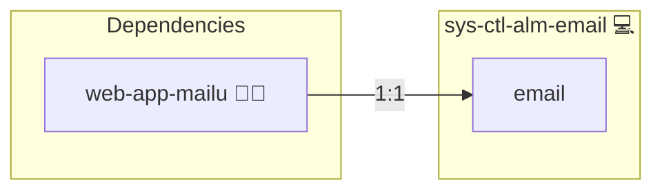

# Automated Email Alerts for Service Failures

## Description

This role installs and configures the necessary components for sending email notifications via systemd when a service fails. It sets up the `{{ system_service_id }}` service and configures email parameters and templates using msmtp.

## Overview

Optimized for secure and reliable service failure notifications, this role is an integral part of the overall `sys-ctl-alm-compose` suite. It ensures that, upon failure of a critical service, an email alert is sent automatically to enable prompt troubleshooting.

## Cosmos

The diagram places Automated Email Alerts for Service Failures in the Infinito.Nexus cosmos: the components it deploys (capabilities), the central services it consumes (dependencies), and its outward reach (federation and bridged external networks).

Solid `1:1` edges are fixed relationships; dashed `0..1` edges are conditional (enabled only in matching deployments). Node markers show the role's deploy modes (💻 host, 🐳 compose, 🐝 swarm); ❌ marks a service that is explicitly turned off, and ⚙️ an Ansible role dependency declared in `meta/main.yml`.

## Purpose

The primary purpose of this role is to provide a comprehensive solution for automated email notifications in a systemd environment. By integrating with msmtp and customizable templates, it delivers clear and timely alerts about service failures, thereby enhancing system reliability.

## Features

- **Service Installation & Configuration:** Installs msmtp and configures the email sending service.
- **Customizable Templates:** Supports tailoring email templates for service failure notifications.
- **Secure Notifications:** Integrates with systemd to trigger email alerts when services fail.
- **Suite Integration:** Part of the `sys-ctl-alm-compose` suite, offering a unified approach to service failure notifications.

## Credits

Implemented by **[Kevin Veen-Birkenbach](https://www.veen.world)**.
Part of the [Infinito.Nexus Project](https://s.infinito.nexus/code) and maintained by [Kevin Veen-Birkenbach](https://www.veen.world).
Licensed under the [Infinito.Nexus Community License (Non-Commercial)](https://s.infinito.nexus/license).
