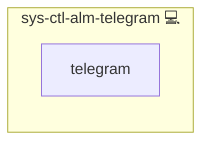

# Automated Telegram Alerts for Service Failures

## Description

This role installs and configures the necessary components for sending notifications via systemd when a service fails. It sets up the `sys-ctl-alm-telegram` service and configures parameters and customizable templates for sending messages through [Telegram](https://telegram.org). <!-- nocheck: url telegram.org answers 404 on the bare root -->

## Overview

Optimized for real-time alerts, this role is a key component of the overall [`sys-ctl-alm-compose` suite](../). It ensures that, upon failure of a critical service, a Telegram message is automatically sent to notify administrators and enable prompt troubleshooting.

## Cosmos

The diagram places Automated Telegram Alerts for Service Failures in the Infinito.Nexus cosmos: the components it deploys (capabilities), the central services it consumes (dependencies), and its outward reach (federation and bridged external networks).

Solid `1:1` edges are fixed relationships; dashed `0..1` edges are conditional (enabled only in matching deployments). Node markers show the role's deploy modes (💻 host, 🐳 compose, 🐝 swarm); ❌ marks a service that is explicitly turned off, and ⚙️ an Ansible role dependency declared in `meta/main.yml`.

## Purpose

The primary purpose of this role is to provide a robust solution for automated Telegram notifications in a systemd environment. By integrating with Telegram’s Bot API and using customizable message templates, it delivers clear and timely alerts about service failures, thereby enhancing system observability and reliability.

## Features

- **Service Installation & Configuration:** Installs and configures necessary components (including the `curl` package).
- **Customizable Templates:** Supports tailored Telegram message templates for service failure notifications.
- **Secure Notifications:** Leverages systemd to trigger alerts automatically when services fail.
- **Suite Integration:** Part of the [`sys-ctl-alm-compose` suite](../) which includes related roles such as [sys-ctl-alm-email](../sys-ctl-alm-email/README.md) and others.

## Credits

Implemented by **[Kevin Veen-Birkenbach](https://www.veen.world)**.
Part of the [Infinito.Nexus Project](https://s.infinito.nexus/code) and maintained by [Kevin Veen-Birkenbach](https://www.veen.world).
Licensed under the [Infinito.Nexus Community License (Non-Commercial)](https://s.infinito.nexus/license).
