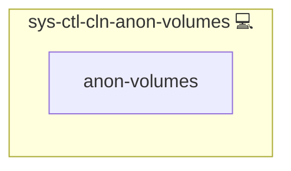

# Cleanup Docker Anonymous Volumes

## Description

This Ansible role installs and executes [`dockreap`](https://github.com/kevinveenbirkenbach/docker-volume-cleaner), a tool designed to clean up unused anonymous Docker volumes (including symlinks and their targets) to maintain a tidy Docker environment.

## Overview

The role installs `dockreap` using Python tooling and runs it with the `--no-confirmation` flag to ensure automatic, non-interactive cleanup.

## Cosmos

The diagram places Cleanup Docker Anonymous Volumes in the Infinito.Nexus cosmos: the components it deploys (capabilities), the central services it consumes (dependencies), and its outward reach (federation and bridged external networks).

Solid `1:1` edges are fixed relationships; dashed `0..1` edges are conditional (enabled only in matching deployments). Node markers show the role's deploy modes (💻 host, 🐳 compose, 🐝 swarm); ❌ marks a service that is explicitly turned off, and ⚙️ an Ansible role dependency declared in `meta/main.yml`.

## Purpose

This role automates the removal of orphaned Docker volumes that consume unnecessary disk space. It is especially useful in backup, CI/CD, or maintenance routines.

## Features

- **Automated Cleanup:** Runs `dockreap --no-confirmation` to remove unused anonymous Docker volumes.
- **Python-based Install:** Installs `dockreap` (isolated, system-friendly CLI install).
- **Idempotent Execution:** Ensures the tool is installed and run only once per playbook run.
- **Symlink-Aware:** Safely handles symlinked `_data` directories and their targets.

## Credits

Implemented by **[Kevin Veen-Birkenbach](https://www.veen.world)**.
Part of the [Infinito.Nexus Project](https://s.infinito.nexus/code) and maintained by [Kevin Veen-Birkenbach](https://www.veen.world).
Licensed under the [Infinito.Nexus Community License (Non-Commercial)](https://s.infinito.nexus/license).
