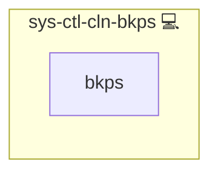

# Cleanup Backups Service

## Description

This role automates the cleanup of old backups by executing a Python script that deletes outdated backup versions based on disk usage thresholds. It ensures that backup storage does not exceed a defined usage percentage.

## Overview

Optimized for effective disk space management, this role:

- Installs required packages (e.g. [lsof](https://en.wikipedia.org/wiki/Lsof) and [psutil](https://pypi.org/project/psutil/)) using pacman.
- Creates a directory for storing cleanup scripts.
- Deploys a Python script that deletes old backup directories when disk usage is too high.
- Configures a systemd service to run the cleanup script, with notifications via [sys-ctl-alm-compose](../sys-ctl-alm-compose/README.md).

## Cosmos

The diagram places Cleanup Backups Service in the Infinito.Nexus cosmos: the components it deploys (capabilities), the central services it consumes (dependencies), and its outward reach (federation and bridged external networks).

Solid `1:1` edges are fixed relationships; dashed `0..1` edges are conditional (enabled only in matching deployments). Node markers show the role's deploy modes (💻 host, 🐳 compose, 🐝 swarm); ❌ marks a service that is explicitly turned off, and ⚙️ an Ansible role dependency declared in `meta/main.yml`.

## Purpose

The primary purpose of this role is to maintain optimal backup storage by automatically removing outdated backup versions when disk usage exceeds a specified threshold.

## Features

- **Automated Cleanup:** Executes a Python script to delete old backups.
- **Threshold-Based Deletion:** Removes backups based on disk usage percentage.
- **Systemd Integration:** Configures a systemd service to run cleanup tasks.
- **Dependency Integration:** Works in conjunction with related roles for comprehensive backup management.

## Other Resources

- <https://stackoverflow.com/questions/48929553/get-hard-disk-size-in-python>

## Credits

Implemented by **[Kevin Veen-Birkenbach](https://www.veen.world)**.
Part of the [Infinito.Nexus Project](https://s.infinito.nexus/code) and maintained by [Kevin Veen-Birkenbach](https://www.veen.world).
Licensed under the [Infinito.Nexus Community License (Non-Commercial)](https://s.infinito.nexus/license).
