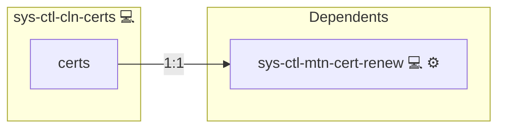

# Certbot Reaper

## Description

## Overview

- Installs the `certreap` cleanup tool using the `pkgmgr-install` role
- Deploys and configures a systemd unit
- (Optionally) Sets up a recurring cleanup via a systemd timer using the `sys-timer` role
- Integrates with `sys-ctl-alm-compose` to send failure notifications
- Ensures idempotent execution with a `run_once_sys_ctl_cln_certs` flag

## Cosmos

The diagram places Certbot Reaper in the Infinito.Nexus cosmos: the components it deploys (capabilities), the central services it consumes (dependencies), and its outward reach (federation and bridged external networks).

Solid `1:1` edges are fixed relationships; dashed `0..1` edges are conditional (enabled only in matching deployments). Node markers show the role's deploy modes (💻 host, 🐳 compose, 🐝 swarm); ❌ marks a service that is explicitly turned off, and ⚙️ an Ansible role dependency declared in `meta/main.yml`.

## Features

- **Certificate Cleanup Tool Installation**  
  Uses `pkgmgr-install` to install the `certreap` binary.

- **Systemd Service Configuration**  
  Deploys service and reloads/restarts it on changes.

- **Systemd Timer Scheduling**  
  Optionally wires in a timer via the `sys-timer` role, controlled by the `on_calendar_cleanup_certs` variable.

- **Smart Execution Logic**  
  Prevents multiple runs in one play by setting a `run_once_sys_ctl_cln_certs` fact.

- **Failure Notification**  
  Triggers service on failure.

## Further Resources

- [Ansible community.general.pacman module](https://docs.ansible.com/ansible/latest/collections/community/general/pacman_module.html)  
- [Infinito.Nexus Community License (Non-Commercial)](https://s.infinito.nexus/license)  
- [systemd.unit(5) manual](https://www.freedesktop.org/software/systemd/man/systemd.unit.html)  

## Credits

Implemented by **[Kevin Veen-Birkenbach](https://www.veen.world)**.
Part of the [Infinito.Nexus Project](https://s.infinito.nexus/code) and maintained by [Kevin Veen-Birkenbach](https://www.veen.world).
Licensed under the [Infinito.Nexus Community License (Non-Commercial)](https://s.infinito.nexus/license).
