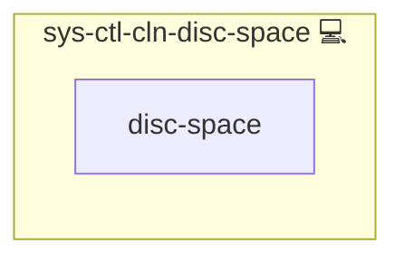

# Cleanup Disc Space

## Description

This role frees disk space by executing a script that cleans up temporary files, clears package caches, and optionally cleans up backup directories and Docker resources when disk usage exceeds a specified threshold.

## Overview

Optimized for efficient storage management, this role:

- Creates a directory for disk cleanup scripts.
- Deploys a Bash script that frees disk space by cleaning up /tmp, Docker resources, and pacman cache.
- Configures a systemd service to run the disk cleanup script.
- Optionally integrates with backup cleanup if backup variables are defined.

## Cosmos

The diagram places Cleanup Disc Space in the Infinito.Nexus cosmos: the components it deploys (capabilities), the central services it consumes (dependencies), and its outward reach (federation and bridged external networks).

Solid `1:1` edges are fixed relationships; dashed `0..1` edges are conditional (enabled only in matching deployments). Node markers show the role's deploy modes (💻 host, 🐳 compose, 🐝 swarm); ❌ marks a service that is explicitly turned off, and ⚙️ an Ansible role dependency declared in `meta/main.yml`.

## Purpose

The primary purpose of this role is to ensure that disk space remains within safe limits by automating cleanup tasks, thereby improving system performance and stability.

## Features

- **Automated Cleanup:** Executes a script to remove temporary files and clear caches.
- **Threshold-Based Execution:** Triggers cleanup when disk usage exceeds a defined percentage.
- **Systemd Integration:** Configures a systemd service to manage the disk cleanup process.
- **Docker and Backup Integration:** Optionally cleans Docker resources and backups if configured.

## Credits

Implemented by **[Kevin Veen-Birkenbach](https://www.veen.world)**.
Part of the [Infinito.Nexus Project](https://s.infinito.nexus/code) and maintained by [Kevin Veen-Birkenbach](https://www.veen.world).
Licensed under the [Infinito.Nexus Community License (Non-Commercial)](https://s.infinito.nexus/license).
