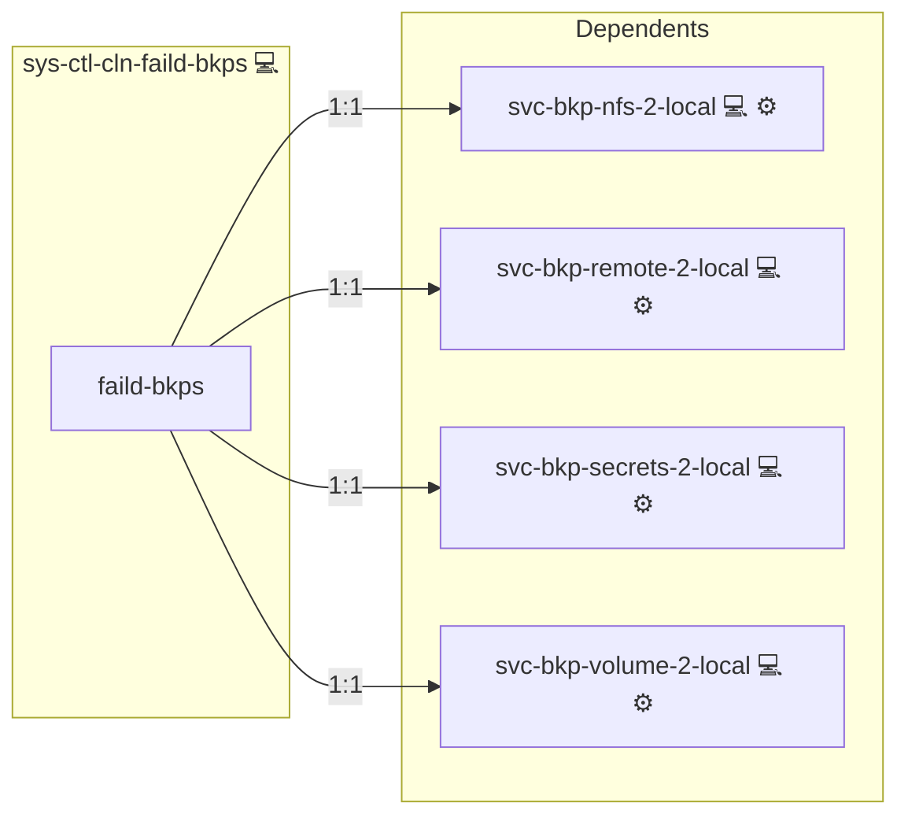

# Cleanup Failed Backups

## Description

This role installs and runs the **cleanback** tool to automatically detect and remove **failed Docker backups**.

The cleanup process scans backup directories located under the configurable path  
**DIR_BACKUPS** (for example `/Backups`)  
and removes only those backups that are detected as invalid, while keeping recent backups safe.

To avoid accidental data loss, the role **keeps the most recent backups by default** and runs fully unattended via a scheduled system service.

## Overview

This role cleans up failed Docker backups by configuring a systemd service and timer to execute the cleanup operations periodically.

## Cosmos

The diagram places Cleanup Failed Backups in the Infinito.Nexus cosmos: the components it deploys (capabilities), the central services it consumes (dependencies), and its outward reach (federation and bridged external networks).



Solid `1:1` edges are fixed relationships; dashed `0..1` edges are conditional (enabled only in matching deployments). Node markers show the role's deploy modes (💻 host, 🐳 compose, 🐝 swarm); ❌ marks a service that is explicitly turned off, and ⚙️ an Ansible role dependency declared in `meta/main.yml`.

## Features

- **Automated provisioning:** Configured by Ansible without manual steps.

## What this role does

- Installs the *cleanback* cleanup tool
- Runs regular, automated cleanup jobs via systemd
- Removes failed backups only
- Preserves the newest backups automatically
- Designed for non-interactive, production-safe operation

## Keeping recent backups safe

By default, the role keeps the **last three backup sets** and does not touch them during cleanup runs.

This behavior is controlled via:

- **CLEANUP_FAILED_BACKUPS_FORCE_KEEP**

Example:

```yaml
CLEANUP_FAILED_BACKUPS_FORCE_KEEP: 3
```

This means:

- For each `backup-docker-to-local` directory, the newest 3 timestamp subdirectories are skipped
- Older backup subdirectories are validated and cleaned if they are invalid

The value can be adjusted or overridden via inventory, group vars, or host vars if needed.

## Failure handling

If a backup validation fails due to infrastructure problems (for example timeouts
or a missing validation tool), the cleanup service exits with a non-zero status.
This allows systemd OnFailure handlers or monitoring systems to react accordingly.

Invalid backups are removed automatically, but infrastructure-related issues
never trigger automatic deletion.

## cleanback tool

The cleanup logic itself is provided by the **cleanback** project:

[cleanup-failed-backups](https://github.com/kevinveenbirkenbach/cleanup-failed-backups)

This role focuses on **safe automation and scheduling**, while the linked project contains the actual cleanup implementation.

## Typical use case

This role is intended for servers that create regular Docker backups and need a reliable way to:

- Keep storage usage under control
- Automatically remove broken or incomplete backups
- Ensure recent backups are never touched

No manual interaction is required once the role is deployed.

## Credits

Implemented by **[Kevin Veen-Birkenbach](https://www.veen.world)**.
Part of the [Infinito.Nexus Project](https://s.infinito.nexus/code) and maintained by [Kevin Veen-Birkenbach](https://www.veen.world).
Licensed under the [Infinito.Nexus Community License (Non-Commercial)](https://s.infinito.nexus/license).
