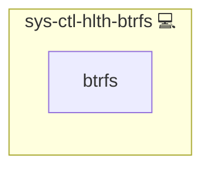

# sys-ctl-hlth-btrfs

## Description

Checks the health of all mounted Btrfs filesystems by inspecting device error counters.

## Overview

This role health-check for Btrfs filesystems, alerts on any device error counters.

## Cosmos

The diagram places sys-ctl-hlth-btrfs in the Infinito.Nexus cosmos: the components it deploys (capabilities), the central services it consumes (dependencies), and its outward reach (federation and bridged external networks).

Solid `1:1` edges are fixed relationships; dashed `0..1` edges are conditional (enabled only in matching deployments). Node markers show the role's deploy modes (💻 host, 🐳 compose, 🐝 swarm); ❌ marks a service that is explicitly turned off, and ⚙️ an Ansible role dependency declared in `meta/main.yml`.

## Features

- Iterates over every Btrfs filesystem.
- Runs `btrfs device stats` and alerts if any error counters are non-zero.
- Hooks into systemd and a timer for regular checks.
- On failure, calls `sys-ctl-alm-compose.infinito@…` for notification.

## Usage

Just include this role in your playbook; it will:

1. Deploy a small shell script
2. Install a `.service` and `.timer` unit.
3. Send alerts via `sys-ctl-alm-compose` if any filesystem shows errors.

## Credits

Implemented by **[Kevin Veen-Birkenbach](https://www.veen.world)**.
Part of the [Infinito.Nexus Project](https://s.infinito.nexus/code) and maintained by [Kevin Veen-Birkenbach](https://www.veen.world).
Licensed under the [Infinito.Nexus Community License (Non-Commercial)](https://s.infinito.nexus/license).
