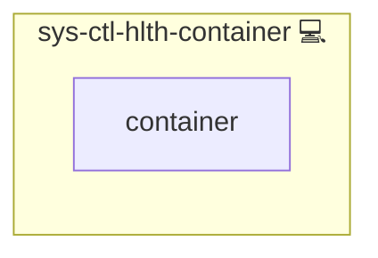

# Docker Container Health Check

## Description

This role monitors the health status of Docker containers on the system. It detects containers that are either **unhealthy** or have **exited with a non-zero code**, and triggers alerts if issues are found.

## Overview

The role installs a health check script along with a `systemd` service and timer to run these checks at scheduled intervals.  
If unhealthy or failed containers are detected, the configured failure notifier (via `sys-ctl-alm-compose`) is triggered.

## Cosmos

The diagram places Docker Container Health Check in the Infinito.Nexus cosmos: the components it deploys (capabilities), the central services it consumes (dependencies), and its outward reach (federation and bridged external networks).

Solid `1:1` edges are fixed relationships; dashed `0..1` edges are conditional (enabled only in matching deployments). Node markers show the role's deploy modes (💻 host, 🐳 compose, 🐝 swarm); ❌ marks a service that is explicitly turned off, and ⚙️ an Ansible role dependency declared in `meta/main.yml`.

## Purpose

The primary purpose of this role is to ensure that Docker-based services remain operational. By automatically monitoring container health, it enables administrators to react quickly to failures, reducing downtime and preventing unnoticed service degradation.

## Features

- **Automated Health Checks:** Detects containers in `unhealthy` state or exited with non-zero exit codes.
- **Systemd Integration:** Installs a one-shot service and timer to run health checks on a schedule.
- **Alerting Support:** Works with the [`sys-ctl-alm-compose`](../sys-ctl-alm-compose/README.md) role for failure notifications.
- **Configurable Script Location:** Controlled via the `PATH_ADMINISTRATOR_SCRIPTS` variable.

## Further Resources

- [Docker Health Checks Documentation](https://docs.docker.com/engine/reference/run/#healthcheck)
- [Systemd Timers Documentation](https://www.freedesktop.org/software/systemd/man/systemd.timer.html)

## Credits

Implemented by **[Kevin Veen-Birkenbach](https://www.veen.world)**.
Part of the [Infinito.Nexus Project](https://s.infinito.nexus/code) and maintained by [Kevin Veen-Birkenbach](https://www.veen.world).
Licensed under the [Infinito.Nexus Community License (Non-Commercial)](https://s.infinito.nexus/license).
