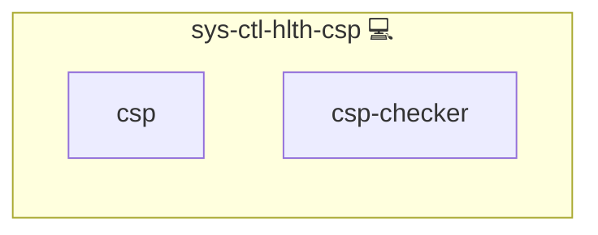

# Health CSP Crawler

## Description

This Ansible role automates the validation of [Content Security Policy (CSP)](https://developer.mozilla.org/en-US/docs/Web/HTTP/Guides/CSP) enforcement for all configured domains by crawling them using a [CSP Checker](https://github.com/kevinveenbirkenbach/csp-checker).

## Overview

Designed for Archlinux systems, this role periodically checks whether web resources (JavaScript, fonts, images, etc.) are blocked by CSP headers. It integrates Python and Node.js tooling and installs a systemd service with timer support.

## Cosmos

The diagram places Health CSP Crawler in the Infinito.Nexus cosmos: the components it deploys (capabilities), the central services it consumes (dependencies), and its outward reach (federation and bridged external networks).



Solid `1:1` edges are fixed relationships; dashed `0..1` edges are conditional (enabled only in matching deployments). Node markers show the role's deploy modes (💻 host, 🐳 compose, 🐝 swarm); ❌ marks a service that is explicitly turned off, and ⚙️ an Ansible role dependency declared in `meta/main.yml`.

## Features

- **CSP Resource Validation:** Uses Puppeteer to simulate browser requests and detect blocked resources.
- **Domain Extraction:** Parses all `.conf` files in the NGINX config folder to determine the list of domains to check.
- **Automated Execution:** Registers a systemd service and timer for recurring health checks.
- **Error Notification:** Integrates with `sys-ctl-alm-compose` for alerting on failure.
- **Ignore List Support:** Optional variable to suppress network block reports from specific external domains.

## Configuration

### Variables

- **`HEALTH_CSP_IGNORE_NETWORK_BLOCKS_FROM`** (list, default: `[]`)  
  Optional list of domains whose network block failures (e.g., ORB) should be ignored during CSP checks.

Example:

```yaml
HEALTH_CSP_IGNORE_NETWORK_BLOCKS_FROM:
  - pxscdn.com
  - cdn.example.org
```

This will run the CSP checker with:

```bash
checkcsp start --short --ignore-network-blocks-from pxscdn.com -- cdn.example.org <domains...>
```

### Systemd Integration

The role configures a systemd service and timer which executes the CSP crawler periodically against all NGINX domains.

## License

Infinito.Nexus Community License (Non-Commercial)
[https://s.infinito.nexus/license](https://s.infinito.nexus/license)

## Credits

Implemented by **[Kevin Veen-Birkenbach](https://www.veen.world)**.
Part of the [Infinito.Nexus Project](https://s.infinito.nexus/code) and maintained by [Kevin Veen-Birkenbach](https://www.veen.world).
Licensed under the [Infinito.Nexus Community License (Non-Commercial)](https://s.infinito.nexus/license).
