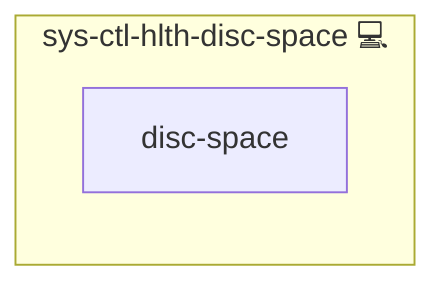

# sys-ctl-hlth-disc-space

## Description

Monitors disk-space usage and alerts if any filesystem usage exceeds your defined threshold.

## Overview

This role disk-space usage monitor; alerts when usage exceeds threshold.

## Cosmos

The diagram places sys-ctl-hlth-disc-space in the Infinito.Nexus cosmos: the components it deploys (capabilities), the central services it consumes (dependencies), and its outward reach (federation and bridged external networks).

Solid `1:1` edges are fixed relationships; dashed `0..1` edges are conditional (enabled only in matching deployments). Node markers show the role's deploy modes (💻 host, 🐳 compose, 🐝 swarm); ❌ marks a service that is explicitly turned off, and ⚙️ an Ansible role dependency declared in `meta/main.yml`.

## Features

- Uses `df` to gather current usage.
- Compares against `size_percent_disc_space_warning` threshold.
- Sends failure alerts via `sys-ctl-alm-compose`.
- Runs on a configurable systemd timer.

## Credits

Implemented by **[Kevin Veen-Birkenbach](https://www.veen.world)**.
Part of the [Infinito.Nexus Project](https://s.infinito.nexus/code) and maintained by [Kevin Veen-Birkenbach](https://www.veen.world).
Licensed under the [Infinito.Nexus Community License (Non-Commercial)](https://s.infinito.nexus/license).
