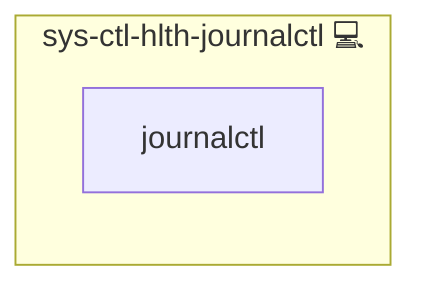

# sys-ctl-hlth-journalctl

## Description

Scans `journalctl` over the last day for “error” entries and alerts if any are found.

## Overview

This role searches the systemd journal for errors over the past day and alerts if any are found.

## Cosmos

The diagram places sys-ctl-hlth-journalctl in the Infinito.Nexus cosmos: the components it deploys (capabilities), the central services it consumes (dependencies), and its outward reach (federation and bridged external networks).

Solid `1:1` edges are fixed relationships; dashed `0..1` edges are conditional (enabled only in matching deployments). Node markers show the role's deploy modes (💻 host, 🐳 compose, 🐝 swarm); ❌ marks a service that is explicitly turned off, and ⚙️ an Ansible role dependency declared in `meta/main.yml`.

## Features

- Runs `journalctl --since '1 day ago' | grep -i error`.
- Exits non-zero on matches.
- Scheduled via systemd timer.
- Alerts via `sys-ctl-alm-compose` on detection.

## Usage

Include the role; set `on_calendar_health_journalctl` for your preferred schedule.

## Credits

Implemented by **[Kevin Veen-Birkenbach](https://www.veen.world)**.
Part of the [Infinito.Nexus Project](https://s.infinito.nexus/code) and maintained by [Kevin Veen-Birkenbach](https://www.veen.world).
Licensed under the [Infinito.Nexus Community License (Non-Commercial)](https://s.infinito.nexus/license).
