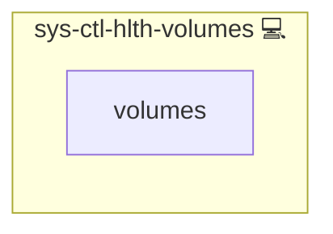

# Docker Volumes Health Check

## Description

This role detects unused **anonymous Docker volumes** that are not bound to any running container.  
It can optionally exclude specific volumes from the check using a configurable whitelist.

## Overview

The role installs a script and a `systemd` service with a timer to periodically scan for leftover anonymous volumes.  
This helps prevent wasted disk space and leftover resources from old deployments.

## Cosmos

The diagram places Docker Volumes Health Check in the Infinito.Nexus cosmos: the components it deploys (capabilities), the central services it consumes (dependencies), and its outward reach (federation and bridged external networks).

Solid `1:1` edges are fixed relationships; dashed `0..1` edges are conditional (enabled only in matching deployments). Node markers show the role's deploy modes (💻 host, 🐳 compose, 🐝 swarm); ❌ marks a service that is explicitly turned off, and ⚙️ an Ansible role dependency declared in `meta/main.yml`.

## Purpose

The main purpose of this role is to keep Docker environments clean by identifying and reporting orphaned anonymous volumes.  
It supports a whitelist mechanism to avoid alerting on known or intentional volumes.

## Features

- **Anonymous Volume Detection:** Identifies volumes with 64-character IDs not attached to any container.
- **Whitelist Support:** Skips volumes listed in `DOCKER_WHITELISTET_ANON_VOLUMES`.
- **Bootstrap Volume Exclusion:** Ignores known bootstrap volumes (e.g., `/var/www/bootstrap`).
- **Systemd Integration:** Installs a one-shot service and timer to automate checks.
- **Alerting Support:** Works with the [`sys-ctl-alm-compose`](../sys-ctl-alm-compose/README.md) role for failure notifications.

## Further Resources

- [Docker Volumes Documentation](https://docs.docker.com/storage/volumes/)
- [Systemd Timers Documentation](https://www.freedesktop.org/software/systemd/man/systemd.timer.html)

## Credits

Implemented by **[Kevin Veen-Birkenbach](https://www.veen.world)**.
Part of the [Infinito.Nexus Project](https://s.infinito.nexus/code) and maintained by [Kevin Veen-Birkenbach](https://www.veen.world).
Licensed under the [Infinito.Nexus Community License (Non-Commercial)](https://s.infinito.nexus/license).
