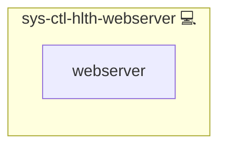

# Webserver Health Check

## Description

This role verifies that each NGINX-served domain returns an expected HTTP status code (200, 301, etc.) and alerts on deviations.

## Overview

The role scans NGINX server block `.conf` files for domains, HEAD-requests each domain, compares the response against per-domain expected codes, and reports mismatches via `sys-ctl-alm-compose`. It is scheduled via a systemd timer for periodic health sweeps. Include this role and define `on_calendar_health_NGINX`. The role installs `requests` via `pip` automatically.

## Cosmos

The diagram places Webserver Health Check in the Infinito.Nexus cosmos: the components it deploys (capabilities), the central services it consumes (dependencies), and its outward reach (federation and bridged external networks).

Solid `1:1` edges are fixed relationships; dashed `0..1` edges are conditional (enabled only in matching deployments). Node markers show the role's deploy modes (💻 host, 🐳 compose, 🐝 swarm); ❌ marks a service that is explicitly turned off, and ⚙️ an Ansible role dependency declared in `meta/main.yml`.

## Features

- **Domain Detection:** Scans NGINX server block `.conf` files for configured domains.
- **HTTP Status Verification:** HEAD-requests each domain and compares the response against per-domain expected codes.
- **Alerting:** Reports mismatches via `sys-ctl-alm-compose`.
- **Scheduled Execution:** Integrates with a systemd timer for periodic health sweeps.

## Further Resources

- [NGINX documentation](https://nginx.org/en/docs/)
- [Ansible uri_module](https://docs.ansible.com/ansible/latest/modules/uri_module.html)

## Credits

Implemented by **[Kevin Veen-Birkenbach](https://www.veen.world)**.
Part of the [Infinito.Nexus Project](https://s.infinito.nexus/code) and maintained by [Kevin Veen-Birkenbach](https://www.veen.world).
Licensed under the [Infinito.Nexus Community License (Non-Commercial)](https://s.infinito.nexus/license).
