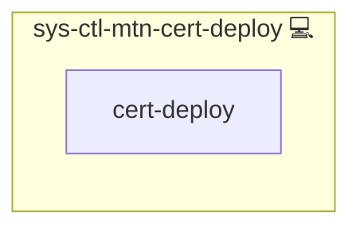

# Docker Compose Certificate Sync Service

## Description

Keeps Docker Compose services updated with fresh Let’s Encrypt certificates via a systemd oneshot service and timer.

## Overview

Installs a small script and a systemd unit that copy certificates into your Compose project and trigger an NGINX hot-reload (fallback: restart) to minimize downtime.

## Cosmos

The diagram places Docker Compose Certificate Sync Service in the Infinito.Nexus cosmos: the components it deploys (capabilities), the central services it consumes (dependencies), and its outward reach (federation and bridged external networks).

Solid `1:1` edges are fixed relationships; dashed `0..1` edges are conditional (enabled only in matching deployments). Node markers show the role's deploy modes (💻 host, 🐳 compose, 🐝 swarm); ❌ marks a service that is explicitly turned off, and ⚙️ an Ansible role dependency declared in `meta/main.yml`.

## Features

- Automatic certificate sync into the Compose project
- Mailu-friendly filenames (`key.pem`, `cert.pem`)
- NGINX hot-reload if available, otherwise restart
- Runs on a schedule you define

## Further Resources

- [Wildcard Certificate Setup (SETUP.md)](./SETUP.md)
- [Role Documentation](https://s.infinito.nexus/code/tree/main/roles/sys-ctl-mtn-cert-deploy)
- [Issue Tracker](https://s.infinito.nexus/issues)

## Credits

Implemented by **[Kevin Veen-Birkenbach](https://www.veen.world)**.
Part of the [Infinito.Nexus Project](https://s.infinito.nexus/code) and maintained by [Kevin Veen-Birkenbach](https://www.veen.world).
Licensed under the [Infinito.Nexus Community License (Non-Commercial)](https://s.infinito.nexus/license).
