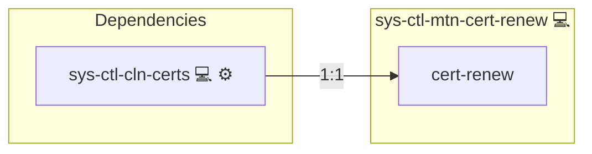

# NGINX Certbot Automation

## Description

This role automates the setup of an automatic [Let's Encrypt](https://letsencrypt.org/) certificate renewal system for NGINX using [Certbot](https://certbot.eff.org/). It ensures that SSL/TLS certificates are renewed seamlessly in the background and that NGINX reloads automatically after successful renewals.

## Overview

Optimized for Archlinux systems, this role installs the `certbot-NGINX` package, configures a dedicated `systemd` service for certificate renewal, and integrates with a `sys-timer` to schedule periodic renewals. After a renewal, NGINX is reloaded to apply the updated certificates immediately.

### Key Features

- **Automatic Renewal:** Schedules unattended certificate renewals using sys-timers.
- **Seamless NGINX Reload:** Reloads the NGINX service automatically after successful renewals.
- **Systemd Integration:** Manages renewal operations reliably with `systemd` and `sys-ctl-alm-compose`.
- **Quiet and Safe Operation:** Uses `--quiet` and `--agree-tos` flags to ensure non-interactive renewals.

## Cosmos

The diagram places NGINX Certbot Automation in the Infinito.Nexus cosmos: the components it deploys (capabilities), the central services it consumes (dependencies), and its outward reach (federation and bridged external networks).

Solid `1:1` edges are fixed relationships; dashed `0..1` edges are conditional (enabled only in matching deployments). Node markers show the role's deploy modes (💻 host, 🐳 compose, 🐝 swarm); ❌ marks a service that is explicitly turned off, and ⚙️ an Ansible role dependency declared in `meta/main.yml`.

## Purpose

The NGINX Certbot Automation role ensures that Let's Encrypt SSL/TLS certificates stay valid without manual intervention. It enhances the security and reliability of web services by automating certificate lifecycle management.

## Features

- **Certbot-NGINX Package Installation:** Installs required certbot plugins for NGINX.
- **Custom Systemd Service:** Configures a lightweight, dedicated renewal service.
- **Timer Setup:** Uses sys-timer to run certbot renewals periodically.
- **Failure Notification:** Integrated with `sys-ctl-alm-compose` for alerting on failures.

## Learn More

- [Certbot Official Website](https://certbot.eff.org/)
- [Let's Encrypt](https://letsencrypt.org/)
- [Systemd (Wikipedia)](https://en.wikipedia.org/wiki/Systemd)
- [HTTPS (Wikipedia)](https://en.wikipedia.org/wiki/HTTPS)

## Credits

Implemented by **[Kevin Veen-Birkenbach](https://www.veen.world)**.
Part of the [Infinito.Nexus Project](https://s.infinito.nexus/code) and maintained by [Kevin Veen-Birkenbach](https://www.veen.world).
Licensed under the [Infinito.Nexus Community License (Non-Commercial)](https://s.infinito.nexus/license).
