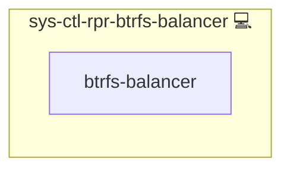

# System Btrfs Auto Balancer

## Description

This role automates the management and balancing of Btrfs file systems. It clones the latest version of the [auto-btrfs-balancer](https://github.com/kevinveenbirkenbach/auto-btrfs-balancer.git) repository and configures a systemd service and timer to run the balancing script automatically.

## Overview

Optimized for automated file system management, this role:

- Clones the auto-btrfs-balancer repository.
- Configures a systemd service to run the balancing script.
- Integrates a systemd timer for regular execution.
- Notifies via systemd in case of errors during the balancing process.

## Cosmos

The diagram places System Btrfs Auto Balancer in the Infinito.Nexus cosmos: the components it deploys (capabilities), the central services it consumes (dependencies), and its outward reach (federation and bridged external networks).

Solid `1:1` edges are fixed relationships; dashed `0..1` edges are conditional (enabled only in matching deployments). Node markers show the role's deploy modes (💻 host, 🐳 compose, 🐝 swarm); ❌ marks a service that is explicitly turned off, and ⚙️ an Ansible role dependency declared in `meta/main.yml`.

## Purpose

The primary purpose of this role is to maintain optimal performance of Btrfs file systems by automating balancing tasks, ensuring efficient storage allocation and performance.

## Features

- **Repository Cloning:** Automatically fetches the latest auto-btrfs-balancer repository.
- **Service Configuration:** Sets up a systemd service for running the balancing script.
- **Timer Integration:** Schedules the balancing process via a systemd timer.
- **Error Notification:** Notifies on failure using sys-ctl-alm-compose.

## Credits

Implemented by **[Kevin Veen-Birkenbach](https://www.veen.world)**.
Part of the [Infinito.Nexus Project](https://s.infinito.nexus/code) and maintained by [Kevin Veen-Birkenbach](https://www.veen.world).
Licensed under the [Infinito.Nexus Community License (Non-Commercial)](https://s.infinito.nexus/license).
