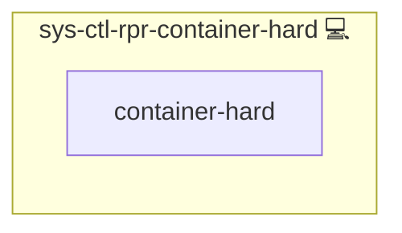

# Docker Auto Restart

## Description

This role automates the restart process for Docker Compose instances within a specified directory. It deploys a Python script that checks for the presence of compose.yml files and restarts the associated services. A hard restart is applied for certain directories if needed.

## Overview

Optimized for containerized environments, this role:

- Sets up the necessary directories and scripts for restarting Docker Compose instances.
- Configures a systemd service (and optionally a timer) to execute the restart script.
- Handles both standard restarts and hard restarts for specific containers (e.g., for Mailu).

## Cosmos

The diagram places Docker Auto Restart in the Infinito.Nexus cosmos: the components it deploys (capabilities), the central services it consumes (dependencies), and its outward reach (federation and bridged external networks).

Solid `1:1` edges are fixed relationships; dashed `0..1` edges are conditional (enabled only in matching deployments). Node markers show the role's deploy modes (💻 host, 🐳 compose, 🐝 swarm); ❌ marks a service that is explicitly turned off, and ⚙️ an Ansible role dependency declared in `meta/main.yml`.

## Purpose

The primary purpose of this role is to ensure that all Docker Compose services are restarted consistently, resolving issues that may arise from partial restarts. This helps maintain overall service stability and minimizes downtime.

## Features

- **Automated Detection:** Scans a specified parent directory for compose.yml files.
- **Service Restart:** Executes a Python script to restart Docker services via compose.
- **Conditional Hard Restart:** Applies a hard restart procedure for specific directories (e.g., Mailu).
- **Systemd Integration:** Configures a systemd service and optionally a timer for scheduled restarts.

## Context

This role was implemented to address the classic issue: ["Have you tried turning it off and on again?"](https://www.youtube.com/watch?v=rksCTVFtjM4). The problem initially arose with the `fetchmail` container in Mailu, which fails if only some containers, and not the full compose composition, are restarted.

## Credits

Implemented by **[Kevin Veen-Birkenbach](https://www.veen.world)**.
Part of the [Infinito.Nexus Project](https://s.infinito.nexus/code) and maintained by [Kevin Veen-Birkenbach](https://www.veen.world).
Licensed under the [Infinito.Nexus Community License (Non-Commercial)](https://s.infinito.nexus/license).
