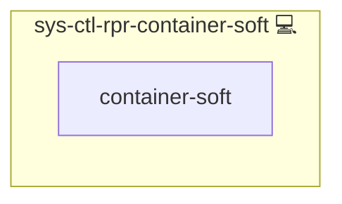

# Docker Healer

## Description

This Ansible role automatically restarts Docker Compose configurations with exited or unhealthy containers on Arch Linux systems. It ensures the stability of containerized workloads by recovering from common error conditions like port binding issues.  

## Overview

Tailored for Arch Linux, this role monitors containers for failure states and initiates a controlled restart of affected Compose configurations. If port conflicts prevent recovery, the role stops the affected stack, restarts Docker, and recreates the container environment.

## Cosmos

The diagram places Docker Healer in the Infinito.Nexus cosmos: the components it deploys (capabilities), the central services it consumes (dependencies), and its outward reach (federation and bridged external networks).

Solid `1:1` edges are fixed relationships; dashed `0..1` edges are conditional (enabled only in matching deployments). Node markers show the role's deploy modes (💻 host, 🐳 compose, 🐝 swarm); ❌ marks a service that is explicitly turned off, and ⚙️ an Ansible role dependency declared in `meta/main.yml`.

## Purpose

The purpose of this role is to provide automated healing for Docker Compose environments, minimizing manual recovery effort and reducing downtime.

## Features

- **Container Health Monitoring:** Detects unhealthy or exited containers.
- **Automated Recovery:** Restarts failed containers and resolves port binding issues.
- **Run-once Setup Logic:** Ensures idempotent execution by controlling task flow with internal flags.
- **System Role Integration:** Seamlessly integrates with Infinito.Nexus system maintenance logic.

## Credits

Implemented by **[Kevin Veen-Birkenbach](https://www.veen.world)**.
Part of the [Infinito.Nexus Project](https://s.infinito.nexus/code) and maintained by [Kevin Veen-Birkenbach](https://www.veen.world).
Licensed under the [Infinito.Nexus Community License (Non-Commercial)](https://s.infinito.nexus/license).
