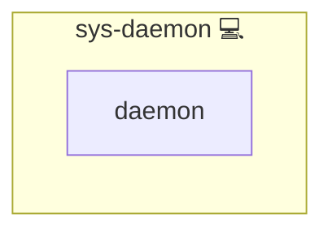

# sys-daemon

## Description

Role to reset and configure the **systemd manager** for Infinito.Nexus.  
It ensures a clean state of the manager configuration and applies default timeout values.

## Overview

- Purges the systemd manager drop-in directory if requested.  
- Validates all active unit files before reload/reexec.  
- Applies default timeout values for systemd manager behavior.  
- Provides handler-based reload/reexec for systemd.  

## Cosmos

The diagram places sys-daemon in the Infinito.Nexus cosmos: the components it deploys (capabilities), the central services it consumes (dependencies), and its outward reach (federation and bridged external networks).

Solid `1:1` edges are fixed relationships; dashed `0..1` edges are conditional (enabled only in matching deployments). Node markers show the role's deploy modes (💻 host, 🐳 compose, 🐝 swarm); ❌ marks a service that is explicitly turned off, and ⚙️ an Ansible role dependency declared in `meta/main.yml`.

## Features

- **Drop-in Purge:** Optionally remove `/etc/systemd/system.conf.d` contents.  
- **Manager Defaults:** Deploys custom timeouts via `timeouts.conf`.  
- **Validation:** Uses `systemd-analyze verify` before reload.  
- **Integration:** Triggers `daemon-reload` or `daemon-reexec` safely.  

## Further Resources

- [systemd - Manager Configuration](https://www.freedesktop.org/software/systemd/man/systemd-system.conf.html)  
- [systemd-analyze](https://www.freedesktop.org/software/systemd/man/systemd-analyze.html)  
- [systemctl](https://www.freedesktop.org/software/systemd/man/systemctl.html)

## Credits

Implemented by **[Kevin Veen-Birkenbach](https://www.veen.world)**.
Part of the [Infinito.Nexus Project](https://s.infinito.nexus/code) and maintained by [Kevin Veen-Birkenbach](https://www.veen.world).
Licensed under the [Infinito.Nexus Community License (Non-Commercial)](https://s.infinito.nexus/license).
