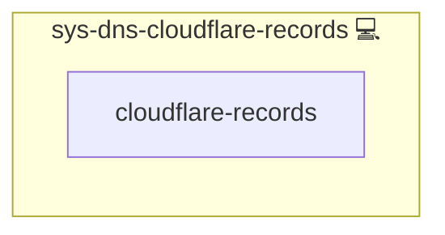

# Cloudflare DNS Records

## Description

Generic, data-driven role to manage DNS records on Cloudflare (A/AAAA, CNAME, MX, TXT, SRV).  
Designed for reuse across apps (e.g., Mailu) and environments.

## Overview

This role wraps `community.general.cloudflare_dns` and applies records from a single
structured variable (`cloudflare_records`). It supports async operations and
can be used to provision all required records for a service in one task.

## Cosmos

The diagram places Cloudflare DNS Records in the Infinito.Nexus cosmos: the components it deploys (capabilities), the central services it consumes (dependencies), and its outward reach (federation and bridged external networks).

Solid `1:1` edges are fixed relationships; dashed `0..1` edges are conditional (enabled only in matching deployments). Node markers show the role's deploy modes (💻 host, 🐳 compose, 🐝 swarm); ❌ marks a service that is explicitly turned off, and ⚙️ an Ansible role dependency declared in `meta/main.yml`.

## Features

- Data-driven input for multiple record types
- Supports A/AAAA, CNAME, MX, TXT, SRV
- Optional async execution
- Minimal logging of secrets

## Further Resources

- [Cloudflare Dashboard → API Tokens](https://dash.cloudflare.com/profile/api-tokens)
- [Ansible Collection: community.general.cloudflare_dns](https://docs.ansible.com/ansible/latest/collections/community/general/cloudflare_dns_module.html)

## Credits

Implemented by **[Kevin Veen-Birkenbach](https://www.veen.world)**.
Part of the [Infinito.Nexus Project](https://s.infinito.nexus/code) and maintained by [Kevin Veen-Birkenbach](https://www.veen.world).
Licensed under the [Infinito.Nexus Community License (Non-Commercial)](https://s.infinito.nexus/license).
