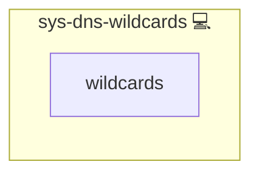

# sys-dns-wildcards

## Description

Create Cloudflare DNS **wildcard** A/AAAA records (`*.parent`) for **parent hosts** (hosts that have children) **and** always for the **apex** (SLD.TLD).

Examples:

- c.wiki.example.com  -> parent: wiki.example.com -> creates: `*.wiki.example.com`
- a.b.example.com     -> parent: b.example.com    -> creates: `*.b.example.com`
- example.com (apex)  -> also creates: `*.example.com`

## Overview

This role create Cloudflare wildcard DNS records (*.parent) for parent hosts; no base or*.apex records.

## Cosmos

The diagram places sys-dns-wildcards in the Infinito.Nexus cosmos: the components it deploys (capabilities), the central services it consumes (dependencies), and its outward reach (federation and bridged external networks).

Solid `1:1` edges are fixed relationships; dashed `0..1` edges are conditional (enabled only in matching deployments). Node markers show the role's deploy modes (💻 host, 🐳 compose, 🐝 swarm); ❌ marks a service that is explicitly turned off, and ⚙️ an Ansible role dependency declared in `meta/main.yml`.

## Features

- **Automated provisioning:** Configured by Ansible without manual steps.

## Inputs

- parent_dns_domains (list[str], optional): FQDNs to evaluate. If empty, the role flattens CURRENT_PLAY_DOMAINS_ALL.
- DOMAIN_PRIMARY (apex), defaults_networks.internet.ip4, optional defaults_networks.internet.ip6
- Flags:
  - parent_dns_enabled (bool, default: true)
  - parent_dns_proxied (bool, default: false)

## Usage

- Include the role once after your constructor stage has set CURRENT_PLAY_DOMAINS_ALL.

## Credits

Implemented by **[Kevin Veen-Birkenbach](https://www.veen.world)**.
Part of the [Infinito.Nexus Project](https://s.infinito.nexus/code) and maintained by [Kevin Veen-Birkenbach](https://www.veen.world).
Licensed under the [Infinito.Nexus Community License (Non-Commercial)](https://s.infinito.nexus/license).
