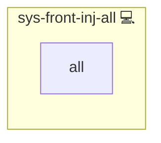

# NGINX Global Matomo & Theming Modifier Role

## Description

This role enhances your NGINX configuration by conditionally injecting global Matomo tracking and theming elements into your HTML responses. It uses NGINX sub-filters to seamlessly add tracking scripts and CSS links to your web pages.

---

## Overview

This role core role for Nginx HTML injection of Matomo, theming, iFrame and JS snippets based on application feature flags.

## Cosmos

The diagram places NGINX Global Matomo & Theming Modifier Role in the Infinito.Nexus cosmos: the components it deploys (capabilities), the central services it consumes (dependencies), and its outward reach (federation and bridged external networks).

Solid `1:1` edges are fixed relationships; dashed `0..1` edges are conditional (enabled only in matching deployments). Node markers show the role's deploy modes (💻 host, 🐳 compose, 🐝 swarm); ❌ marks a service that is explicitly turned off, and ⚙️ an Ansible role dependency declared in `meta/main.yml`.

## Features

- **Global Matomo Tracking**  
  The role includes Matomo tracking configuration and injects the corresponding tracking script into your HTML.

- **Global Theming**  
  The role injects a global CSS link for consistent theming across your site.

- **Smart Injection**  
  Uses NGINX's `sub_filter` to insert the tracking and theming snippets right before the closing `</head>` tag of your HTML documents.

This will automatically activate Matomo tracking and/or global theming based on your configuration.

---

## Credits

Implemented by **[Kevin Veen-Birkenbach](https://www.veen.world)**.
Part of the [Infinito.Nexus Project](https://s.infinito.nexus/code) and maintained by [Kevin Veen-Birkenbach](https://www.veen.world).
Licensed under the [Infinito.Nexus Community License (Non-Commercial)](https://s.infinito.nexus/license).
