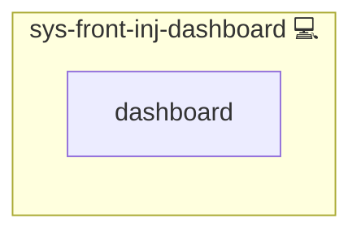

# iFrame Notifier for NGINX

## Description

This Ansible role injects a small JavaScript snippet into your HTML responses that enables parent pages to get notified whenever the iframe’s location changes and forces external links to open in a new tab.

---

## Overview

This role injects a JS snippet into HTML to notify parent windows of iframe location changes and force external links to new tabs.

## Cosmos

The diagram places iFrame Notifier for NGINX in the Infinito.Nexus cosmos: the components it deploys (capabilities), the central services it consumes (dependencies), and its outward reach (federation and bridged external networks).

Solid `1:1` edges are fixed relationships; dashed `0..1` edges are conditional (enabled only in matching deployments). Node markers show the role's deploy modes (💻 host, 🐳 compose, 🐝 swarm); ❌ marks a service that is explicitly turned off, and ⚙️ an Ansible role dependency declared in `meta/main.yml`.

## Features

- **Location Change Notification**  
  Uses `postMessage` to inform the parent window of any URL changes inside the iframe (including pushState/popState events) for seamless SPA support.

- **External Link Handling**  
  Automatically sets `target="_blank"` and `rel="noopener"` on links pointing outside your primary domain to improve security and user experience.

- **Easy CSP Integration**  
  Calculates a CSP hash for the injected script so you can safely allow it via your Content Security Policy.

---

## Credits

Implemented by **[Kevin Veen-Birkenbach](https://www.veen.world)**.
Part of the [Infinito.Nexus Project](https://s.infinito.nexus/code) and maintained by [Kevin Veen-Birkenbach](https://www.veen.world).
Licensed under the [Infinito.Nexus Community License (Non-Commercial)](https://s.infinito.nexus/license).
