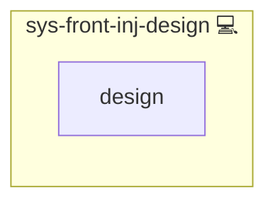

# Corporate Design Injection for NGINX

## Description

This Ansible role injects the corporate design into every NGINX-served application whose `design` service is enabled.
It derives the design tokens from the single base color in `web-svc-design` through the [design_palette](../../plugins/lookup/design_palette.py) lookup (OKLCH, WCAG 2.2 contrast by construction) and maps them onto Bootstrap and common app variables.

## Overview

The role renders the shared `default.css` and `bootstrap.css` once per deployment onto the CDN, links them with a cache-busting version, and adds the role's own `style.css` and `design.js` when the role ships them.
Light and dark tokens switch with `prefers-color-scheme`; a role mirrors an app-native theme switch through `<html data-design-theme="light|dark">`.

## Cosmos

The diagram places Corporate Design Injection for NGINX in the Infinito.Nexus cosmos: the components it deploys (capabilities), the central services it consumes (dependencies), and its outward reach (federation and bridged external networks).

Solid `1:1` edges are fixed relationships; dashed `0..1` edges are conditional (enabled only in matching deployments); red `0..0` edges are turned off in this role. Node markers show the role's deploy modes (💻 host, 🐳 compose, 🐝 swarm); ❌ marks a service that is explicitly turned off, and ⚙️ an Ansible role dependency declared in `meta/main.yml`.

## Purpose

The goal of this role is to provide a **single source of truth for theming** across your infrastructure.  
It makes all applications feel like part of the same ecosystem, visually and functionally.

## Features

- 🎨 **Semantic design tokens** derived from one base color in OKLCH
- ♿ **WCAG 2.2 contrast** guaranteed for text, links, controls and status colors
- 📁 **Unified CSS Base Configuration** deployment for all NGINX applications
- 🌒 **Dark mode** via `prefers-color-scheme` or an app-native switch
- 🧩 **Design script channel** for a role's `design.js.j2`
- 🚫 **No duplication** – tasks run once per deployment
- ⏱️ **Versioning logic** to bust browser cache
- 🎯 **Bootstrap override compatibility**
- 🧩 **Theme support for Keycloak, Nextcloud, Gitea, LAM, Peertube, and more**

## Credits

Implemented by **[Kevin Veen-Birkenbach](https://www.veen.world)**.
Part of the [Infinito.Nexus Project](https://s.infinito.nexus/code) and maintained by [Kevin Veen-Birkenbach](https://www.veen.world).
Licensed under the [Infinito.Nexus Community License (Non-Commercial)](https://s.infinito.nexus/license).
