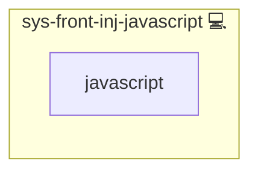

# Global JavaScript Injector for NGINX

## Description

This Ansible role injects a custom JavaScript snippet into all HTML responses served by NGINX. It leverages NGINX’s `sub_filter` to seamlessly insert your application-specific script just before the closing `</head>` tag, ensuring that your code runs on every page load, which is useful for global feature flags, analytics, or UI enhancements.

## Overview

This role injects a custom JavaScript snippet into Nginx-served HTML responses via sub_filter.

## Cosmos

The diagram places Global JavaScript Injector for NGINX in the Infinito.Nexus cosmos: the components it deploys (capabilities), the central services it consumes (dependencies), and its outward reach (federation and bridged external networks).

Solid `1:1` edges are fixed relationships; dashed `0..1` edges are conditional (enabled only in matching deployments). Node markers show the role's deploy modes (💻 host, 🐳 compose, 🐝 swarm); ❌ marks a service that is explicitly turned off, and ⚙️ an Ansible role dependency declared in `meta/main.yml`.

## Features

- **One-line Script Injection**  
  Collapses your JavaScript into a single line and injects it via `sub_filter` for minimal footprint and maximal compatibility.

- **Easy CSP Integration**  
  Automatically computes and appends a CSP hash entry for your script, so you can lock down Content Security Policy without lifting a finger.

- **Conditional Activation**  
  Activates only when you enable the `javascript` feature for a given application, keeping your server blocks clean and performant.

- **Debug Mode**  
  Supports an `MODE_DEBUG` flag that appends optional `console.log` statements for easier troubleshooting in staging or development.

## Credits

Implemented by **[Kevin Veen-Birkenbach](https://www.veen.world)**.
Part of the [Infinito.Nexus Project](https://s.infinito.nexus/code) and maintained by [Kevin Veen-Birkenbach](https://www.veen.world).
Licensed under the [Infinito.Nexus Community License (Non-Commercial)](https://s.infinito.nexus/license).
