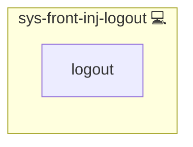

# sys-front-inj-logout

This role injects a catcher that intercepts all logout elements in HTML pages served by NGINX and redirects them to a centralized logout endpoint via JavaScript.

## Description

The `sys-front-inj-logout` Ansible role automatically embeds a lightweight JavaScript snippet into your web application's HTML responses. This script identifies logout links, buttons, forms, and other elements, overrides their target URLs, and ensures users are redirected to a central OIDC logout endpoint, providing a consistent single sign‑out experience.

## Overview

- **Detection**: Scans the DOM for anchors (`<a>`), buttons, inputs, forms, `use` elements and any attributes indicating logout functionality.  
- **Override**: Rewrites logout URLs to point at your OIDC provider’s logout endpoint, including a redirect back to the application.  
- **Dynamic content support**: Uses a `MutationObserver` to handle AJAX‑loaded or dynamically injected logout elements.  
- **CSP integration**: Automatically appends the required script hash into your CSP policy via the role’s CSP helper.

## Cosmos

The diagram places sys-front-inj-logout in the Infinito.Nexus cosmos: the components it deploys (capabilities), the central services it consumes (dependencies), and its outward reach (federation and bridged external networks).

Solid `1:1` edges are fixed relationships; dashed `0..1` edges are conditional (enabled only in matching deployments). Node markers show the role's deploy modes (💻 host, 🐳 compose, 🐝 swarm); ❌ marks a service that is explicitly turned off, and ⚙️ an Ansible role dependency declared in `meta/main.yml`.

## Features

- Seamless injection via NGINX `sub_filter` on `</head>`.  
- Automatic detection of various logout mechanisms (links, buttons, forms).  
- Centralized logout redirection for a unified user experience.  
- No changes required in application code.  
- Compatible with SPAs and dynamically generated content.  
- CSP‑friendly: manages script hash for you.

## Further Resources

- [OpenID Connect RP-Initiated Logout](https://openid.net/specs/openid-connect-session-1_0.html#RPLogout)  
- [NGINX `sub_filter` Module](http://NGINX.org/en/docs/http/ngx_http_sub_module.html)  
- [Ansible Role Directory Structure](https://docs.ansible.com/ansible/latest/user_guide/playbooks_roles.html#role-directory-structure)

## Credits

Implemented by **[Kevin Veen-Birkenbach](https://www.veen.world)**.
Part of the [Infinito.Nexus Project](https://s.infinito.nexus/code) and maintained by [Kevin Veen-Birkenbach](https://www.veen.world).
Licensed under the [Infinito.Nexus Community License (Non-Commercial)](https://s.infinito.nexus/license).
