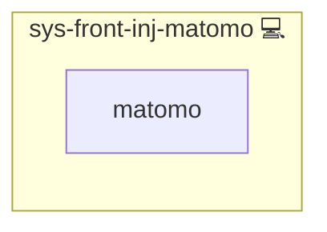

# NGINX Matomo Tracking Role

## Description

This Ansible role automates the integration of Matomo tracking code into NGINX-served websites. It simplifies the process of adding the Matomo analytics tracking script and image tracker to all your web pages served through NGINX.

## Overview

This role injects Matomo analytics tracking code and noscript image tracker into Nginx-served HTML pages.

## Cosmos

The diagram places NGINX Matomo Tracking Role in the Infinito.Nexus cosmos: the components it deploys (capabilities), the central services it consumes (dependencies), and its outward reach (federation and bridged external networks).

Solid `1:1` edges are fixed relationships; dashed `0..1` edges are conditional (enabled only in matching deployments). Node markers show the role's deploy modes (💻 host, 🐳 compose, 🐝 swarm); ❌ marks a service that is explicitly turned off, and ⚙️ an Ansible role dependency declared in `meta/main.yml`.

## Features

- Automated insertion of Matomo tracking script into the `</head>` tag of HTML pages.
- Integration of a noscript image tracker before the `</body>` tag for tracking users with JavaScript disabled.
- Configuration to apply changes on every request, ensuring that dynamic content and single-page applications are also tracked.

## Requirements

- NGINX installed on the target server.
- Matomo analytics platform set up and accessible.

## Dependencies

- None. This role is designed to be included in NGINX server block configurations.

## Customization

You can customize the tracking script and the noscript image tracker by editing the `matomo-tracking.js.j2` and `matomo.subfilter.conf.j2` templates.

## Credits

Implemented by **[Kevin Veen-Birkenbach](https://www.veen.world)**.
Part of the [Infinito.Nexus Project](https://s.infinito.nexus/code) and maintained by [Kevin Veen-Birkenbach](https://www.veen.world).
Licensed under the [Infinito.Nexus Community License (Non-Commercial)](https://s.infinito.nexus/license).
