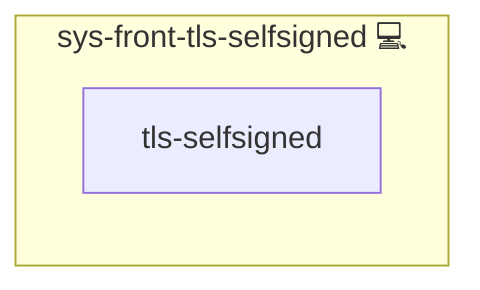

# sys-front-tls-selfsigned

## Description

Self-signed TLS provider for sys-front-tls (SAN aware).

## Overview

This role self-signed TLS provider for sys-front-tls (SAN aware). Generates and stores self-signed certificates.

## Cosmos

The diagram places sys-front-tls-selfsigned in the Infinito.Nexus cosmos: the components it deploys (capabilities), the central services it consumes (dependencies), and its outward reach (federation and bridged external networks).

Solid `1:1` edges are fixed relationships; dashed `0..1` edges are conditional (enabled only in matching deployments). Node markers show the role's deploy modes (💻 host, 🐳 compose, 🐝 swarm); ❌ marks a service that is explicitly turned off, and ⚙️ an Ansible role dependency declared in `meta/main.yml`.

## Features

- **Automated provisioning:** Configured by Ansible without manual steps.

## Inputs

- tls_domain
- application_id
- tls_selfsigned_base
- tls_selfsigned_days
- tls_selfsigned_key_bits
- tls_selfsigned_subject (C/O/OU/CN)

## Credits

Implemented by **[Kevin Veen-Birkenbach](https://www.veen.world)**.
Part of the [Infinito.Nexus Project](https://s.infinito.nexus/code) and maintained by [Kevin Veen-Birkenbach](https://www.veen.world).
Licensed under the [Infinito.Nexus Community License (Non-Commercial)](https://s.infinito.nexus/license).
