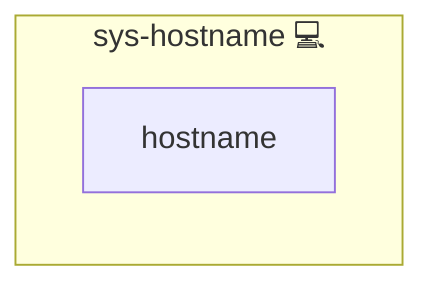

# Hostname

This Ansible role ensures that the target host’s system hostname is set to the inventory hostname.

## Description

- Uses the built-in `hostname` module to apply the `inventory_hostname` value  
- Idempotent: only changes the system name if it differs  
- No external dependencies

## Overview

1. **Task**  
   - `set hostname to {{ inventory_hostname }}`  
     Applies the desired hostname.
2. **Module**  
   - Leverages Ansible’s [`hostname`](https://docs.ansible.com/ansible/latest/collections/ansible/builtin/hostname_module.html) module.

## Cosmos

The diagram places Hostname in the Infinito.Nexus cosmos: the components it deploys (capabilities), the central services it consumes (dependencies), and its outward reach (federation and bridged external networks).

Solid `1:1` edges are fixed relationships; dashed `0..1` edges are conditional (enabled only in matching deployments). Node markers show the role's deploy modes (💻 host, 🐳 compose, 🐝 swarm); ❌ marks a service that is explicitly turned off, and ⚙️ an Ansible role dependency declared in `meta/main.yml`.

## Features

- Simple and lightweight
- Automatically adapts to your inventory names
- Safe to run repeatedly

## Credits

Implemented by **[Kevin Veen-Birkenbach](https://www.veen.world)**.
Part of the [Infinito.Nexus Project](https://s.infinito.nexus/code) and maintained by [Kevin Veen-Birkenbach](https://www.veen.world).
Licensed under the [Infinito.Nexus Community License (Non-Commercial)](https://s.infinito.nexus/license).
