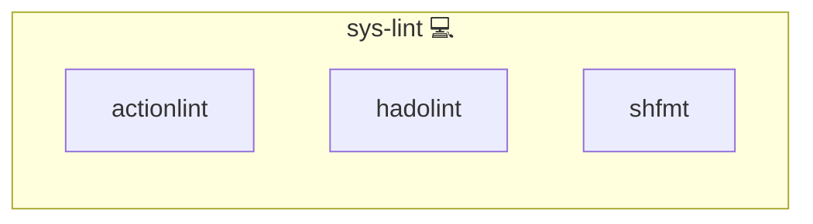

# Lint

## Description

This role is the single point of truth for the release pins of the lint tools that the toolchain installs from GitHub releases: [actionlint](https://github.com/rhysd/actionlint), [hadolint](https://github.com/hadolint/hadolint) and [shfmt](https://github.com/mvdan/sh).

It deploys nothing. Its only content is `meta/services.yml`, which records the `repository` and `ref` of every pinned tool.

## Overview

`make install-lint` used to ask GitHub for each tool's latest tag at install time. That made every installation depend on the network resolving `api.github.com`, and it silently changed the linter version between two runs of the same commit. Pinning moves the version into the repository, where it is reviewable and reproducible.

Because the pins use the same `(repository, ref)` shape as every other `meta/services.yml`, the existing `update-repository-refs` CI job discovers them on its own: it resolves the newest semver tag of each repository via `git ls-remote --tags` and opens a pull request with the bump. Upgrading a linter is therefore a reviewed commit, not a surprise.

## Cosmos

The diagram places Lint in the Infinito.Nexus cosmos: the components it deploys (capabilities), the central services it consumes (dependencies), and its outward reach (federation and bridged external networks).



Solid `1:1` edges are fixed relationships; dashed `0..1` edges are conditional (enabled only in matching deployments). Node markers show the role's deploy modes (💻 host, 🐳 compose, 🐝 swarm); ❌ marks a service that is explicitly turned off, and ⚙️ an Ansible role dependency declared in `meta/main.yml`.

## Features

- **Reproducible installs:** every tool resolves to the pinned `ref`, so the same commit installs the same linter version on every host and in every CI run.
- **Offline-tolerant:** no tag lookup at install time, so a DNS or API outage no longer breaks `make install-lint`.
- **Automatically updated:** the `update-repository-refs` job bumps the pins to the newest semver tag and opens a pull request.
- **One override per tool:** `ACTIONLINT_VERSION`, `HADOLINT_VERSION` and `SHFMT_VERSION` override the pin for a one-off install without editing the role.

## Usage

The pins are read by `utils/install/lint/pinned.py`, which every lint installer calls:

```python
from utils.install.lint.pinned import resolve_release

slug, version = resolve_release("actionlint")
```

To pin a different version by hand, edit the tool's `ref` in `meta/services.yml`. To add a tool, add an entry with its `repository` and `ref` — the CI updater picks it up without further wiring.

## Credits

Implemented by **Kevin Veen-Birkenbach**.
Part of the [Infinito.Nexus Project](https://s.infinito.nexus/code) and maintained by [Kevin Veen-Birkenbach](https://www.veen.world).
Licensed under the [Infinito.Nexus Community License (Non-Commercial)](https://s.infinito.nexus/license).
