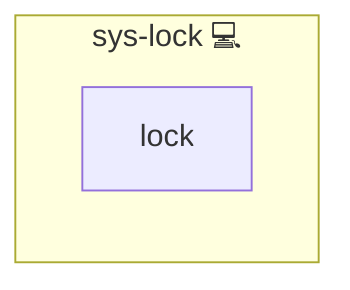

# System Maintenance Lock

## Description

This role provides a locking mechanism to ensure that critical services are not interrupted during maintenance activities such as updates, backups, or patch applications. It waits for specified services to stop and prevents conflicting operations.

## Overview

The role performs the following:

- Blocks execution until specified services have stopped.
- Implements retry logic with a configurable timeout.
- Ensures that maintenance tasks are executed only when the system is in a safe state.

## Cosmos

The diagram places System Maintenance Lock in the Infinito.Nexus cosmos: the components it deploys (capabilities), the central services it consumes (dependencies), and its outward reach (federation and bridged external networks).

Solid `1:1` edges are fixed relationships; dashed `0..1` edges are conditional (enabled only in matching deployments). Node markers show the role's deploy modes (💻 host, 🐳 compose, 🐝 swarm); ❌ marks a service that is explicitly turned off, and ⚙️ an Ansible role dependency declared in `meta/main.yml`.

## Purpose

The primary purpose of this role is to safeguard system stability during maintenance by preventing conflicts with running services. It ensures that maintenance operations proceed only when the environment is ready.

## Features

- **Service Locking:** Blocks maintenance tasks until critical services are stopped.
- **Timeout and Retry Logic:** Configurable wait times and maximum attempts.
- **Conflict Avoidance:** Prevents interference between maintenance operations and running services.

## Credits

Implemented by **[Kevin Veen-Birkenbach](https://www.veen.world)**.
Part of the [Infinito.Nexus Project](https://s.infinito.nexus/code) and maintained by [Kevin Veen-Birkenbach](https://www.veen.world).
Licensed under the [Infinito.Nexus Community License (Non-Commercial)](https://s.infinito.nexus/license).
