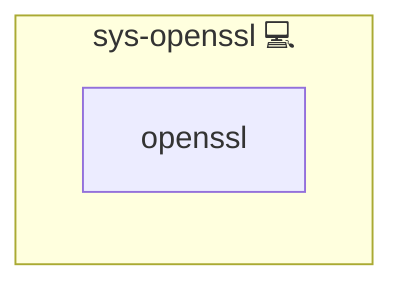

# sys-openssl

## Description

Ensures that the `openssl` CLI is installed on the host.

This role is intended as a shared dependency for other roles that execute
OpenSSL commands on the host system.

## Overview

This role ensures OpenSSL is installed once as a shared host dependency for roles that invoke the `openssl` CLI.

## Cosmos

The diagram places sys-openssl in the Infinito.Nexus cosmos: the components it deploys (capabilities), the central services it consumes (dependencies), and its outward reach (federation and bridged external networks).



Solid `1:1` edges are fixed relationships; dashed `0..1` edges are conditional (enabled only in matching deployments). Node markers show the role's deploy modes (💻 host, 🐳 compose, 🐝 swarm); ❌ marks a service that is explicitly turned off, and ⚙️ an Ansible role dependency declared in `meta/main.yml`.

## Features

- **Automated provisioning:** Configured by Ansible without manual steps.

## Behavior

- Installs package: `openssl`
- Uses standard Infinito run-once flagging via `run_once_sys_openssl`

## Usage

```yaml
- include_role:
    name: sys-openssl
  when: run_once_sys_openssl is not defined
```

## Credits

Implemented by **[Kevin Veen-Birkenbach](https://www.veen.world)**.
Part of the [Infinito.Nexus Project](https://s.infinito.nexus/code) and maintained by [Kevin Veen-Birkenbach](https://www.veen.world).
Licensed under the [Infinito.Nexus Community License (Non-Commercial)](https://s.infinito.nexus/license).
