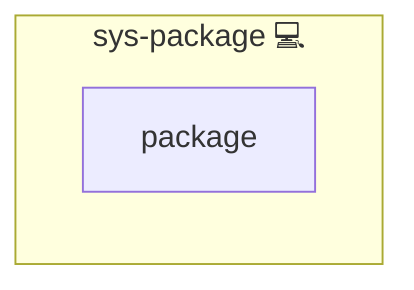

# sys-package

## Description

This role installs additional system packages defined directly in host or group inventory variables.

## Overview

This role installs system packages defined via the inventory variable `SYS_PACKAGES`.

## Cosmos

The diagram places sys-package in the Infinito.Nexus cosmos: the components it deploys (capabilities), the central services it consumes (dependencies), and its outward reach (federation and bridged external networks).



Solid `1:1` edges are fixed relationships; dashed `0..1` edges are conditional (enabled only in matching deployments). Node markers show the role's deploy modes (💻 host, 🐳 compose, 🐝 swarm); ❌ marks a service that is explicitly turned off, and ⚙️ an Ansible role dependency declared in `meta/main.yml`.

## Features

- **Automated provisioning:** Configured by Ansible without manual steps.

## Variables

- `SYS_PACKAGES` (list, default: `[]`)
  List of package names to install with the system package manager.

## Inventory Example

```yaml
all:
  hosts:
    myhost:
      SYS_PACKAGES:
      - htop
      - tree
      - jq
```

When `SYS_PACKAGES` is empty, the role does nothing.

## Credits

Implemented by **[Kevin Veen-Birkenbach](https://www.veen.world)**.
Part of the [Infinito.Nexus Project](https://s.infinito.nexus/code) and maintained by [Kevin Veen-Birkenbach](https://www.veen.world).
Licensed under the [Infinito.Nexus Community License (Non-Commercial)](https://s.infinito.nexus/license).
