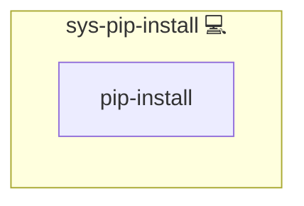

# sys-pip-install

## Description

This role installs or upgrades a Python package **system-wide** using the system `pip` (`python3 -m pip`).
It is intended for CLI tools that should be available globally (e.g., maintenance utilities).

> This role depends on `sys-pip`, which ensures that `pip` is installed on the target system.

## Overview

- Ensures the system `pip` is available (via `sys-pip`).
- Installs or upgrades a package specified by `package_name`.
- Designed for non-interactive automation (CI/maintenance hosts).

## Cosmos

The diagram places sys-pip-install in the Infinito.Nexus cosmos: the components it deploys (capabilities), the central services it consumes (dependencies), and its outward reach (federation and bridged external networks).

Solid `1:1` edges are fixed relationships; dashed `0..1` edges are conditional (enabled only in matching deployments). Node markers show the role's deploy modes (💻 host, 🐳 compose, 🐝 swarm); ❌ marks a service that is explicitly turned off, and ⚙️ an Ansible role dependency declared in `meta/main.yml`.

## Features

- **Automated provisioning:** Configured by Ansible without manual steps.

## Variables

### Required

- `package_name` (string)  
  Name of the Python package to install (e.g., `dockreap`, `backup-docker-to-local`).

## Notes / Caveats

- The role checks whether `pip` from `ansible_python_interpreter` supports `--break-system-packages` and only uses it (plus `PIP_BREAK_SYSTEM_PACKAGES=1`) when available.
  This keeps the role compatible with older `pip` versions (e.g., some CentOS/RHEL systems).
- Use with care: installing Python packages system-wide can conflict with OS package management.
  For isolated installs of CLI tools, consider `pipx` instead.

## Credits

Implemented by **[Kevin Veen-Birkenbach](https://www.veen.world)**.
Part of the [Infinito.Nexus Project](https://s.infinito.nexus/code) and maintained by [Kevin Veen-Birkenbach](https://www.veen.world).
Licensed under the [Infinito.Nexus Community License (Non-Commercial)](https://s.infinito.nexus/license).
