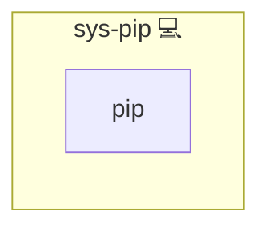

# Python-Pip

## Description

This role installs the [python-pip](https://en.wikipedia.org/wiki/Pip_(package_manager)) package on the target system. It ensures that the pip package manager is available for installing Python packages.

## Overview

Optimized for simplicity and idempotency, this role:

- Installs the python-pip package using [pacman](https://wiki.archlinux.org/title/Pacman).
- Sets a flag to ensure the installation tasks run only once.

## Cosmos

The diagram places Python-Pip in the Infinito.Nexus cosmos: the components it deploys (capabilities), the central services it consumes (dependencies), and its outward reach (federation and bridged external networks).

Solid `1:1` edges are fixed relationships; dashed `0..1` edges are conditional (enabled only in matching deployments). Node markers show the role's deploy modes (💻 host, 🐳 compose, 🐝 swarm); ❌ marks a service that is explicitly turned off, and ⚙️ an Ansible role dependency declared in `meta/main.yml`.

## Purpose

The primary purpose of this role is to provide a reliable installation of the Python package manager, pip, ensuring that subsequent Python package installations can proceed without issues.

## Features

- **Pip Installation:** Installs python-pip if not already present.
- **Idempotency:** Ensures tasks are executed only once.

## Credits

Implemented by **[Kevin Veen-Birkenbach](https://www.veen.world)**.
Part of the [Infinito.Nexus Project](https://s.infinito.nexus/code) and maintained by [Kevin Veen-Birkenbach](https://www.veen.world).
Licensed under the [Infinito.Nexus Community License (Non-Commercial)](https://s.infinito.nexus/license).
