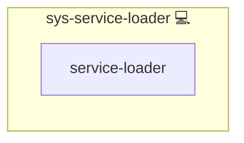

# sys-service-loader

## Description

SPOT loader for shared services. Drives the ordered preload pass via
`tasks/main.yml` and the post-load queue flush, plus the shared helper
`tasks/list_or_shoot.yml` used by service roles to route their dependent
roles through the loader's queue.

## Overview

Loader role providing the shared-service preload pass and helper tasks
for queueing post-load role inclusions.

## Cosmos

The diagram places sys-service-loader in the Infinito.Nexus cosmos: the components it deploys (capabilities), the central services it consumes (dependencies), and its outward reach (federation and bridged external networks).

Solid `1:1` edges are fixed relationships; dashed `0..1` edges are conditional (enabled only in matching deployments). Node markers show the role's deploy modes (💻 host, 🐳 compose, 🐝 swarm); ❌ marks a service that is explicitly turned off, and ⚙️ an Ansible role dependency declared in `meta/main.yml`.

## Features

- **Automated provisioning:** Configured by Ansible without manual steps.

## Credits

Implemented by **[Kevin Veen-Birkenbach](https://www.veen.world)**.
Part of the [Infinito.Nexus Project](https://s.infinito.nexus/code) and maintained by [Kevin Veen-Birkenbach](https://www.veen.world).
Licensed under the [Infinito.Nexus Community License (Non-Commercial)](https://s.infinito.nexus/license).
