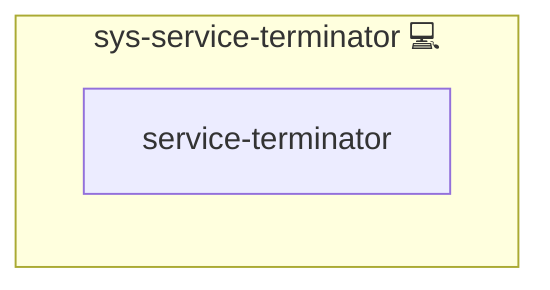

# sys-service-terminator

## Description

Runs a collected list of systemd services at the **end of a play**.
This is useful for services where flush/restart is suppressed during setup,
but should be started once everything they depend on is ready.

## Overview

This role runs a collected list of systemd services at the end of a play.

## Cosmos

The diagram places sys-service-terminator in the Infinito.Nexus cosmos: the components it deploys (capabilities), the central services it consumes (dependencies), and its outward reach (federation and bridged external networks).

Solid `1:1` edges are fixed relationships; dashed `0..1` edges are conditional (enabled only in matching deployments). Node markers show the role's deploy modes (💻 host, 🐳 compose, 🐝 swarm); ❌ marks a service that is explicitly turned off, and ⚙️ an Ansible role dependency declared in `meta/main.yml`.

## Features

- **Automated provisioning:** Configured by Ansible without manual steps.

## How it works

- Consumes `system_service_run_list` (created by `sys-service` when `system_service_force_flush_final=true`).
- Enables and starts/restarts each service.
- Shows diagnostics (`systemctl status`, `journalctl -xeu`) on failure.

## Variables

- `system_service_run_list` (list): list of systemd unit names to run
- `SYS_SERVICE_RUNNER_STATE` (string): desired state (`started`, `restarted`, ...)  

## Further Resources

- <https://www.freedesktop.org/software/systemd/man/systemctl.html>

## Credits

Implemented by **[Kevin Veen-Birkenbach](https://www.veen.world)**.
Part of the [Infinito.Nexus Project](https://s.infinito.nexus/code) and maintained by [Kevin Veen-Birkenbach](https://www.veen.world).
Licensed under the [Infinito.Nexus Community License (Non-Commercial)](https://s.infinito.nexus/license).
