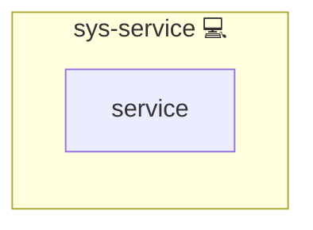

# sys-service

## Description

Role to manage **systemd service units** for Infinito.Nexus software stacks.
It installs or removes unit files, configures runtime behavior, and ensures services are properly deployed.

## Overview

- Resets service units by removing old or obsolete definitions.
- Deploys new service unit files and service scripts.
- Optionally sets up timers linked to the services.
- Ensures correct reload/restart behavior across the stack.
- Provides the shared `files/debug.sh` SPOT for reusable service-failure diagnostics.
- Exposes `tasks/utils/debug.yml` as the canonical Ansible wrapper around that script.

## Cosmos

The diagram places sys-service in the Infinito.Nexus cosmos: the components it deploys (capabilities), the central services it consumes (dependencies), and its outward reach (federation and bridged external networks).

Solid `1:1` edges are fixed relationships; dashed `0..1` edges are conditional (enabled only in matching deployments). Node markers show the role's deploy modes (💻 host, 🐳 compose, 🐝 swarm); ❌ marks a service that is explicitly turned off, and ⚙️ an Ansible role dependency declared in `meta/main.yml`.

## Features

- **Unit Cleanup:** Automated removal of old service units.
- **Custom Templates:** Supports both `systemctl.service.j2` and `systemctl@.service.j2`.
- **Timers:** Integrates with `sys-timer` for scheduled execution.
- **Runtime Limits:** Configurable `RuntimeMaxSec` per service.
- **Handlers:** Automatic reload/restart of services when definitions change.
- **Shared Diagnostics:** Centralized `systemctl`/`journalctl`/unit-file diagnostics via `files/debug.sh`.
- **Wrapper Task:** Reusable Ansible include in `tasks/utils/debug.yml` for calling and printing the shared diagnostics.

## Further Resources

- [systemd - Service Units](https://www.freedesktop.org/software/systemd/man/systemd.service.html)
- [systemd - Timer Units](https://www.freedesktop.org/software/systemd/man/systemd.timer.html)
- [systemctl](https://www.freedesktop.org/software/systemd/man/systemctl.html)

## Credits

Implemented by **[Kevin Veen-Birkenbach](https://www.veen.world)**.
Part of the [Infinito.Nexus Project](https://s.infinito.nexus/code) and maintained by [Kevin Veen-Birkenbach](https://www.veen.world).
Licensed under the [Infinito.Nexus Community License (Non-Commercial)](https://s.infinito.nexus/license).
